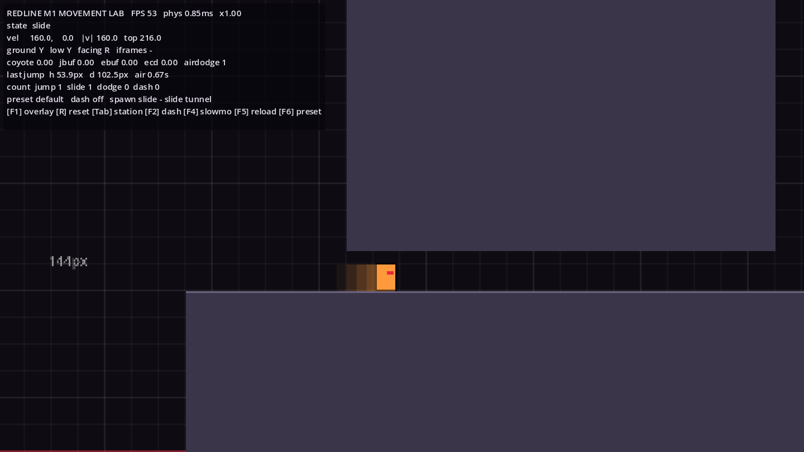
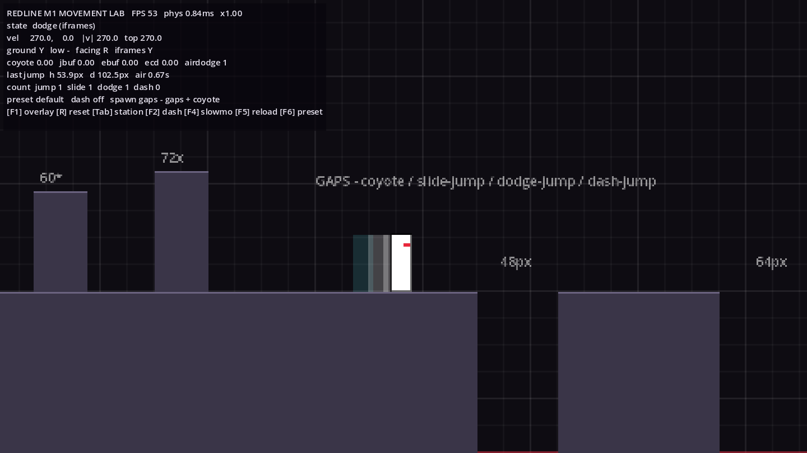
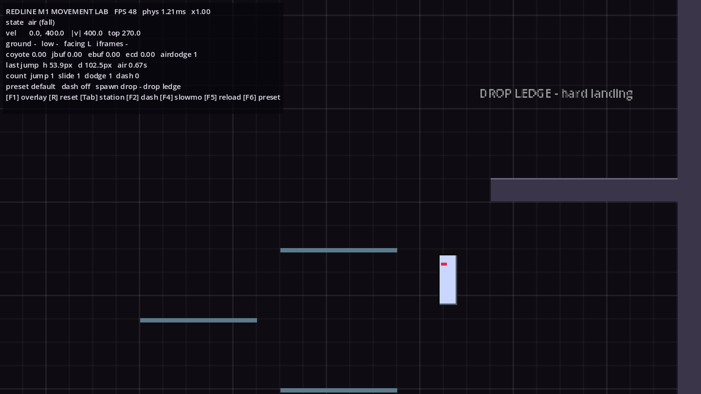
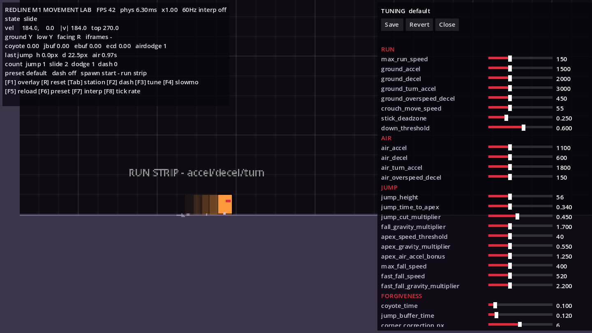

# M1 Movement Report

**Status:** M0 and M1 are implemented, plus an M1 polish pass (live tuning panel, placeholder SFX, dust, high-refresh toggles). **Development has stopped here for human playtesting (bible §38.13).** Combat (M2) has not been started.

| | |
|---|---|
| Engine | Godot 4.3 stable (GDScript, GL Compatibility) |
| Canvas | 480×270, integer-scaled (window opens at 1440×810) |
| Rook | 12×34 px standing collider, 12×16 px low (crouch/slide) |
| Run it | Open `redline/project.godot` in Godot 4.3+ and press F5. It boots into the Movement Lab. |






---

## 1. Controls

| Action | Keyboard | Controller (Xbox names) |
|---|---|---|
| Move | A/D or ←/→ | Left stick / D-pad |
| Crouch / slide (down while running) | S or ↓ | Stick down (≥ 0.6) / D-pad down |
| Jump (hold = higher) | Space, K, Z | A |
| Drop through one-way platform | Down + Jump | Down + A |
| Dodge (or Dash once unlocked) | Shift, L, C | B or RT |
| Reset to the current station | R | Back / View |
| Next station (teleport) | Tab | R3 |
| Debug overlay | F1 | L3 |
| Toggle Dash unlock (lab only) | F2 | — |
| Live tuning panel (mouse) | F3 | — |
| Slow motion ×0.25 | F4 | — |
| Hot-reload the current tuning file | F5 | — |
| Cycle tuning preset | F6 | — |
| Toggle physics interpolation | F7 | — |
| Physics tick rate 60 ↔ 120 Hz | F8 | — |

Combat actions (J, I, O, U, H, E / X, Y, RB, LB, LT, D-pad up) are already bound for M2 but do nothing yet.

## 2. Lab stations (Tab cycles through them)

| # | Station | What to test |
|---|---|---|
| 1 | Run strip | Acceleration, stopping, turnarounds. The 16/64 px grid helps you read speed. |
| 2 | Jump heights: pillars 16, 32, 48, **60\***, **72x** | \* 60 is reachable only thanks to ledge forgiveness; x means unreachable by design. |
| 3 | Gaps 48 / 64 / 112 / 144 px | 48 and 64 are plain jumps (use coyote time at the edge). 112 needs a **slide-jump**, 144 a **dodge-jump**, and dash-jump clears it easily. |
| 4 | Slide tunnel (24 px) + stand tunnel (40 px) | Slide in and release down inside. You should crouch-walk out and never pop up into the ceiling. The 40 px tunnel must *not* force a crouch. |
| 5 | Corner correction | Jump at the ceiling slab's edges. You should slip past the corner instead of bonking. |
| 6 | Slopes (26°) | Run up and down both ways. Speed should stay constant, with no launching off the crest. |
| 7 | One-way stack | Jump up through the platforms, then drop down with down + jump. |
| 8 | Drop ledge (336 px) | Hard landing: camera kick plus a small shake. The fall look-down starts after about 260 px/s. |

## 3. Tuning

All values live in `data/movement/*.tres` (`PlayerMovementConfig`), and camera values in `data/camera/default_camera.tres`. The fastest loop is **F3**: drag sliders while playing, and changes apply on the next tick. **Save** writes the preset file and **Revert** reloads it. You can also edit a `.tres` in the Godot inspector and press **F5** in game. No controller code needs to change.

### Key defaults

| Group | Values |
|---|---|
| Run | max 150 px/s · accel 1500 · decel 2000 · turn 3000 · overspeed decay 450 (ground) / 150 (air) |
| Jump | height 56 px · apex at 0.34 s · fall gravity ×1.7 · jump cut ×0.45 · apex hang gravity ×0.55 below 40 px/s · max fall 400 (520 when fast-falling) |
| Forgiveness | coyote 0.10 s · jump buffer 0.12 s · evade buffer 0.10 s · corner correction 6 px · ledge step-up 5 px |
| Slide | entry ≥ 90 px/s · +70 boost (cap 260) · friction 240 · 0.18–0.65 s · slide-jump +30 px/s at 0.8× height |
| Dodge | 270 px/s for 0.22 s · i-frames 0.02–0.18 s · cooldown 0.30 s · jump-cancel after 0.08 s · 1 air dodge |
| Dash | 400 px/s for 0.16 s · exits at 230 px/s · i-frames for the first 0.08 s · cooldown 0.25 s |
| Camera | dead zone 20×36 · look-ahead 56 px at ≥ 220 px/s · follow rates 9 (x) / 6 (y) · shake max 6×5 px |

### Measured in-engine (`devtools/MovementProbe.tscn`, 60 Hz)

| preset | frames to max run | stop dist | slide dist | dodge dist | jump h / d | slide-jump h / d | dodge-jump h / d | dash-jump h / d |
|---|---|---|---|---|---|---|---|---|
| default | 6 | 4.4 | 92.8 | 63.0 | 56.4 / 102.5 | 45.2 / 117.6 | 56.4 / 148.6 | 56.4 / 237.5 |
| floaty (experiment) | 9 | 7.0 | 86.3 | 63.0 | 64.9 / 130.7 | 52.4 / 146.4 | 64.9 / 185.9 | 64.9 / 306.8 |
| tight (experiment) | 5 | 3.5 | 89.5 | 55.0 | 52.2 / 99.2 | 41.8 / 110.6 | 52.2 / 148.8 | 52.2 / 207.1 |

All distances are in px, measured centre to centre. A 12 px body clears a gap about 12 px wider than its centre-to-centre jump distance. **Level-metric takeaways:** a plain run-jump covers about 100 px and rises 56 px, which is about 1.6 body heights. Slide-jump is the "long, low" option, dodge-jump pushes about 150 px, and dash-jump roughly doubles the run-jump. These numbers should drive gap and ledge metrics in M3.

## 4. What's implemented (bible §5 feel tech)

- **Responsiveness:** transitions chain within the same tick, so pressing jump on the frame you land jumps immediately. Turning around uses a separate, higher acceleration.
- **Coyote time and jump buffer:** both are timers in config and both are covered by tests. Coyote is granted only when you *walk* off a ledge, never after a jump.
- **Variable jump:** releasing jump while rising cuts vertical speed once. Holding at the apex lowers gravity and grants 1.25× air acceleration for precise corrections.
- **Fast-fall:** hold down while falling for more gravity and a higher speed cap.
- **Momentum preservation:** above run speed (after a slide, dash or dodge-jump) the character keeps drifting and slows gently while you hold forward. Letting go stops quickly.
- **Corner correction and ledge forgiveness:** a small nudge around ceiling corners, and a step-up onto ledge lips.
- **Cancels:** slide → jump, dodge → jump (after 0.08 s), dash → jump (after 0.05 s), slide → dodge. Landing while holding down at speed goes straight into a slide.
- **Stance safety:** the character only stands up where the head room is clear (a shape cast). A slide that ends under a ceiling becomes a crouch.
- **Camera:** see D-012. Rules: never fight the player, never whip on turnarounds, never constant shake. The shake intensity setting is already wired.

## 5. Acceptance criteria (bible §38)

| Criterion | Status | Evidence |
|---|---|---|
| Keyboard and controller responsive | ⚠️ Needs a human | Parity enforced by test. No dead frames on state changes. Real-controller latency not yet felt. |
| Jump buffer / coyote reliable | ✅ Automated | `test_coyote_*`, `test_jump_buffer_fires_on_landing` |
| Slide transitions reliable | ✅ Automated | `test_slide_through_low_tunnel_without_sticking` (slide → crouch-walk → stand) |
| No random geometry sticking | ✅ Automated (lab) + ⚠️ human | Tunnel, corner, ledge and one-way tests; `test_every_spawn_lands_cleanly` |
| Camera doesn't fight the player | ⚠️ Needs a human | Dead zone, floor-locked vertical, held look-ahead; `test_camera_stays_inside_bounds` |
| Restart instant | ✅ | R / Back resets in the same physics tick; the kill plane respawns (tested) |
| Tuning without editing controller logic | ✅ | All values in `.tres`; F3 live sliders; F5 hot reload; F6 presets (`test_tuning_panel`) |
| Stable 60 FPS in lab | ⚠️ Needs real hardware | Physics averages 1.5 ms per tick (3.7 ms worst) with dust and audio active. Only software-rendered FPS was observable here (K-2). |
| Moving for minutes is fun | ⚠️ **This is the gate** | Human playtest required. |

## 6. Known issues
See `KNOWN_ISSUES.md`. The main ones: no human playtest yet (K-1), FPS not verified on real hardware (K-2), the high-refresh toggles haven't been checked on a real 120/144 Hz display (K-3), slides are fully committed (K-5), and the sounds are placeholder blips (K-11).

## 7. Experiments to try in the playtest
1. **Presets:** play the whole lab once each with default, tight and floaty (F6). Which one feels most like "movement is life"?
2. **Dodge vs Dash:** run the gap station with F2 off and then on. Does Dash feel like an upgrade? Should it be a separate button? (D-005)
3. **Coyote / buffer extremes:** try `coyote_time` 0.06 vs 0.14, and `jump_buffer_time` 0.08 vs 0.16. Edit, save, press F5.
4. **Jump arc:** `fall_gravity_multiplier` 1.4 vs 2.0 changes the jump from floaty to snappy without changing its height.
5. **Camera:** try `look_ahead_distance` 32 vs 80 and `dead_zone` 12×24 vs 32×48. Report any motion discomfort.
6. **High refresh:** on a 144 Hz display, compare the default (60 Hz, no interpolation) with **F7** (interpolation on) and **F8** (120 Hz physics). Look for judder while running and for camera jitter. Jump height stays the same at 120 Hz (tested).
7. **Audio and dust:** do the placeholder sounds help you read timing (landing, dodge start, dash)? Is anything annoying after five minutes? Turn the SFX bus down if needed; the setting is `Settings.sfx_volume`.

## 8. Playtest checklist (please send answers back)
- In the first minute, did the controls feel good without explanation? What felt off?
- Did you ever press jump and feel it was ignored? Where?
- Did you get stuck on or snag against geometry anywhere? Which station?
- Did the camera ever make you lose sight of where you were going, or feel nauseating?
- Which preset did you prefer, and what would you change about it?
- Could you clear the 112 and 144 px gaps? How many tries did it take?
- Did you keep playing after testing, just moving around for fun? For how long?

## 9. How to verify locally
```bash
cd redline
godot --headless --import                                          # once after cloning (builds the class cache)
godot --headless --fixed-fps 60 res://tests/TestRunner.tscn        # 37 tests; exit code 1 on failure
godot --headless --fixed-fps 60 res://devtools/MovementProbe.tscn  # the table in section 3
```
