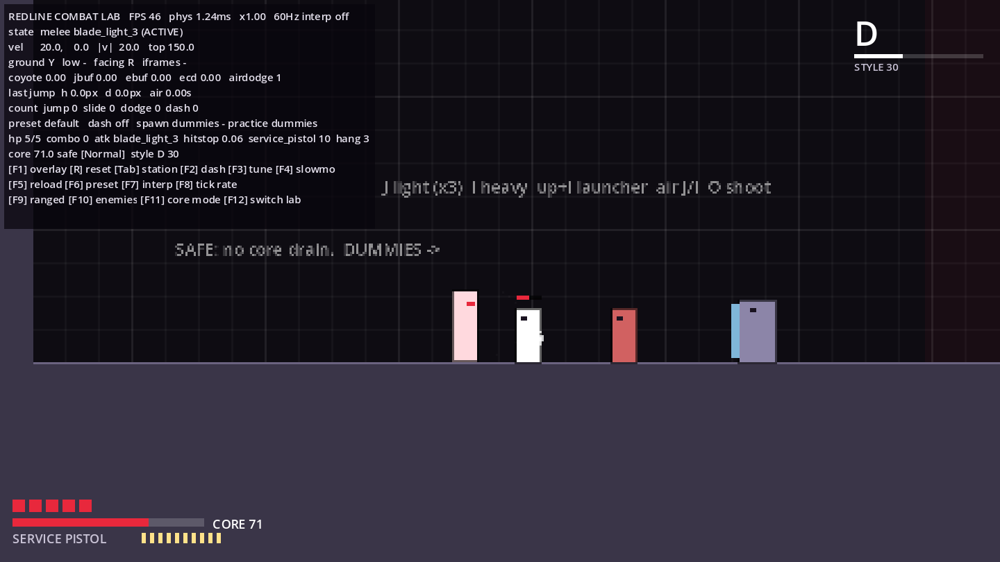
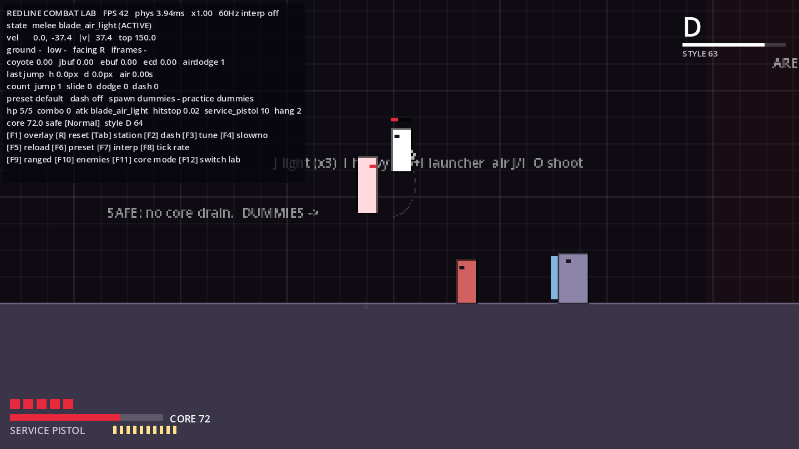
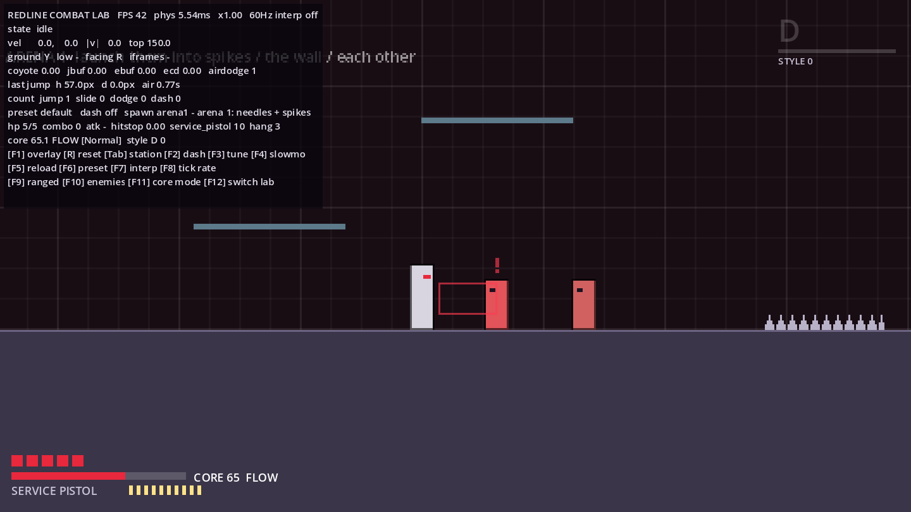
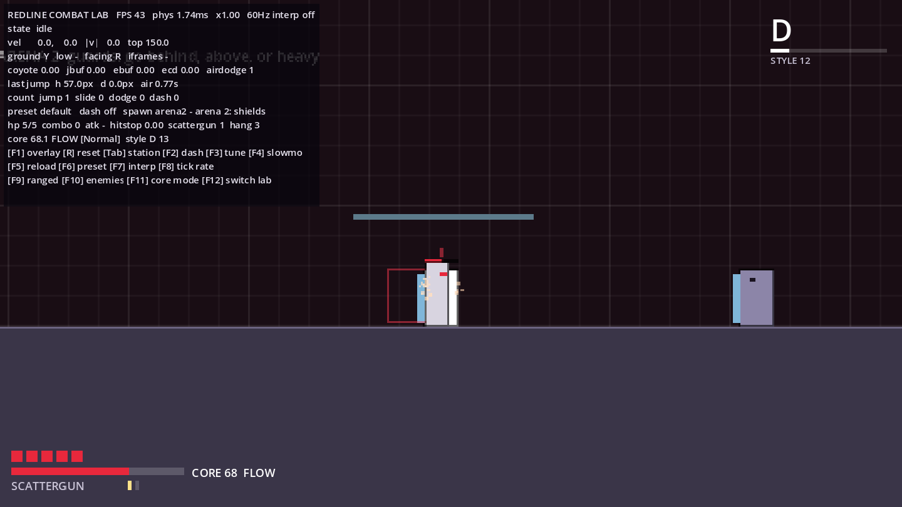
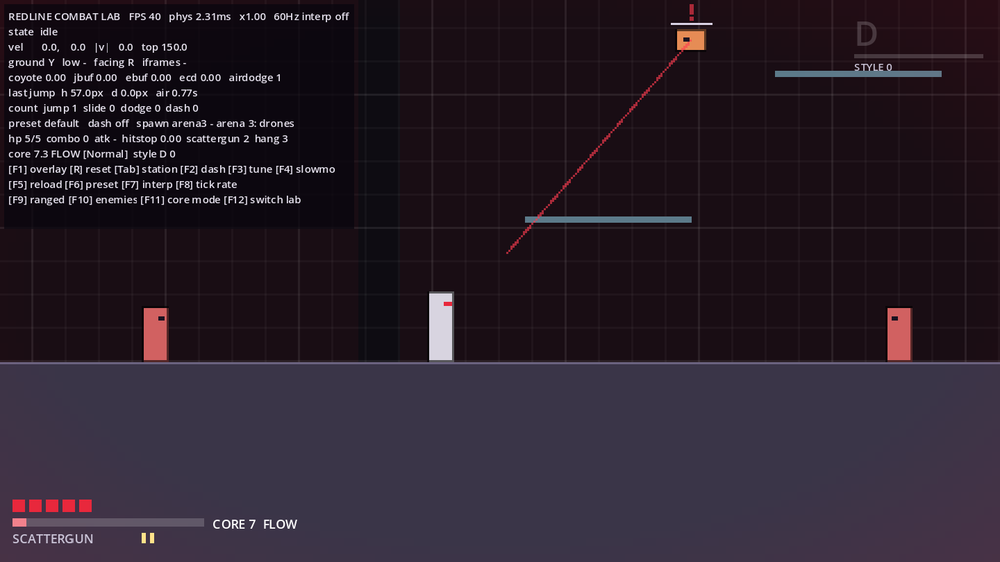

# M2 Combat Report

**Status:** the M2 Combat Lab is implemented. **Development has stopped here for human playtesting.** M3 (vertical slice) has not been started.

M1 has still not been playtested by a person. The user chose to start M2 anyway, so feedback on movement and on combat can come from the same playtest.

| | |
|---|---|
| Scope (bible §36 M2) | Pulse Blade, pistol, Scattergun · three enemies · damage/stagger/launch · hitstop · placeholder VFX · reactor prototype · style prototype |
| Run it | Open `redline/project.godot`, then F5. The game boots into the **Combat Lab**. F12 switches to the Movement Lab. |
| Tests | 71 headless tests, all passing (34 new for M2) |







---

## 1. Controls (combat additions)

| Action | Keyboard | Controller (Xbox names) |
|---|---|---|
| Light attack (3-hit chain; in the air: air slash with hang) | J | X |
| Heavy (breaks guards) · **up + heavy = launcher** · in the air: downward spike | I | Y |
| Shoot (aim with the move keys: 8-way in the air, forward/up on the ground) | O | RB |
| Dodge (i-frames; a *perfect* dodge refills the core) | Shift / L / C | B / RT |
| Cycle ranged weapon: Pistol ↔ Scattergun (lab) | F9 | — |
| Respawn all enemies (lab) | F10 | — |
| Cycle core mode: Normal / Story-Assist / Redline Challenge | F11 | — |
| Switch between Combat Lab and Movement Lab | F12 | — |

All M1 controls and dev keys still work (F1 overlay, R reset, Tab station, F2 Dash, F3 tuning panel, …).

## 2. The Combat Lab

| Station (Tab) | What's there | What it teaches |
|---|---|---|
| Safe start | No Flow Zone, so the core doesn't drain | Breathing room (bible §2.3) |
| Dummies | 2 Needles and 1 Shield that never attack; they come back 1.5 s after death | Chains, launcher, air combos, guard rules |
| Arena 1 | 3 Needles, a spike strip, a knee-high "slam wall", one-way platforms | Launching enemies into spikes, walls and each other |
| Arena 2 | 2 Shields and 1 Needle | Guards: hit from behind, from above, or with a heavy |
| Arena 3 | 2 Scout Drones and 1 Needle, platforms | Shooting, air attacks, dodging projectiles |

The arenas are Flow Zones, so the core drains inside them. Enemies there respawn 4–5 s after dying, and the Encounter Director lets at most **2 enemies attack at once**.

## 3. Systems

### Hits and weapons (all data)
- `AttackData` (bible §8) covers:
  - timing: startup, active, recovery, cancel windows;
  - the hit: damage, poise damage, knockback, hitstop, hitbox, guard-break;
  - style and reactor values;
  - the attacker's own motion: lunge, momentum kept, air hang, gravity scale;
  - an optional projectile.
- `WeaponData` bundles attacks. Weapons live in `data/weapons/*.tres`:

| Weapon | Moves |
|---|---|
| Pulse Blade | light ×3 (10 / 10 / 14 dmg), heavy 22 (breaks guards), launcher 12 (sends enemies up about 390 px/s), air light 8 (hang), air heavy 16 (spike) |
| Service Pistol | 6 dmg, 10 rounds, 0.14 s between shots, long range, precise |
| Scattergun | 6 pellets × 5 dmg in an even 26° fan, 2 shells, about 96 px range, big knockback; mid-air recoil nudge (see D-018) |

- **Cancels:** a light attack can go into the next light or a jump after 0.11 s, and into a dodge after 0.05 s. The launcher jump-cancels after 0.16 s so you can follow the enemy up. A slide can go straight into an attack, keeping part of its momentum.
- **Hitstop:** the attacker and victim both freeze. The duration comes from the attack data and is scaled by `Settings.hitstop_scale`. Button presses are still buffered during the freeze.

### Enemies
- **One shared body, three behaviors** (bible §32). `Enemy` owns:
  - perception;
  - telegraphed attacks: wind-up → active → recovery;
  - poise/stagger and armor;
  - launch physics, collisions with other enemies, wall slams, hazards;
  - hitstop and death.
- `EnemyBehavior` decides where to stand, which attack to use, and whether its guard stops a hit.

| Enemy | Role | Notes |
|---|---|---|
| **Needle** | Light melee grunt | 30 hp, poise 10. Lunging stab with a 0.45 s telegraph. Easy to launch. |
| **Shield** | Armored bruiser | 60 hp, poise 40, mass 2.5. Blocks frontal hits unless they break guards, come from above, or land during stagger. Turns slowly (0.5 s) and bashes. |
| **Scout Drone** | Flying ranged | 20 hp. Hovers to the side and above you. Fires a slow 150 px/s bolt after a 0.7 s aim-line telegraph. Falls out of the air when staggered. |

- **Readability rules:**
  - Every enemy telegraph lasts at least 0.3 s; data validation fails otherwise.
  - Wind-ups show a red "!", the attack's hitbox outline or aim line, and a pulsing tint.
  - Enemies show a health bar once damaged.
- **Environmental kills:**
  - Enemies launched faster than 170 px/s damage whatever they hit (other enemies, walls).
  - Spikes kill enemies outright.
  - These kills are credited to whoever launched the enemy, for both style and reactor.

### Player damage, perfect dodge, death
- 5 health pips. Every M2 enemy attack deals 1 (bible §7: forgiving early game).
- A hit gives 0.22 s of stun and 0.9 s of invulnerability, shown by blinking.
- **Perfect dodge:** getting hit within 0.14 s of starting a dodge or dash. It costs no damage, gives a brief freeze, style +70 and core +10.
- Spikes hurt Rook even mid-dodge (positioning matters) and bounce him out.
- On death Rook respawns at the current station after 0.4 s, with full health and a refilled core.

### Redline Core (prototype of bible §6)
- The core **only drains inside Flow Zones** (5 per second on Normal).
- **It refills from:**
  - every hit you land;
  - kills, which give more at higher style ranks;
  - environmental kills (extra);
  - perfect dodges;
  - hits landed right after a slide, dodge or dash (movement feats).
- **At 25 or below it goes critical:** a heartbeat that speeds up as the core empties, a pulsing core bar, and a red vignette. With flash reduction on, the pulse and vignette stay static.
- **At 0 it burns out:** Rook loses 1 health pip every 1.5 s until the core refills.
- **Modes** are presets in `data/reactor/`. Normal: drain 5. Story/Assist: drain 2.5, gains ×1.5. Redline Challenge: drain 8, gains ×0.8, 1.5× score multiplier (stored, not used yet).

### Style (prototype of bible §10)
- Ranks go **D → C → B → A → S → SS → SSS → REDLINE**.
- **Repetition decays:** each identical attack tag in the last 5 hits multiplies that hit's style by 0.55.
- **Bonuses and multipliers:**
  - aerial hits ×1.3;
  - hits within 0.45 s of a slide, dodge or dash ×1.35;
  - kills add the enemy's style value;
  - environmental kills ×1.6;
  - a perfect dodge adds +70.
- **Losses:** points decay after 1.2 s without a gain, faster at high ranks. Taking a hit keeps only 40% of your points.
- Style never gates progress. Its only reward right now is a bigger core refill on kills.

### Placeholder presentation
- **VFX:** slash arcs, impact sparks (blue on a block), muzzle sparks, tracers, death bursts.
- **SFX:** 18 new synthesized sounds (swing, hit, block, shots, reload, telegraph, enemy death, hurt, perfect dodge, heartbeat, burnout, rank up).
- **HUD:** health pips, core bar with FLOW indicator, weapon name and ammo pips, style rank with progress bar.

## 4. Acceptance vs the bible (M2 scope)

| M2 item | Status | Evidence |
|---|---|---|
| Pulse Blade, pistol, Scattergun | ✅ | `data/weapons/*.tres`; `test_light_chain_*`, `test_pistol_*`, `test_scattergun_*` |
| Three enemies | ✅ | Needle, Shield, Scout Drone; `test_shield_*`, `test_enemy_telegraphs_*` |
| Damage / stagger / launch | ✅ | `test_launcher_launches_enemy`, `test_launched_enemy_damages_the_one_it_hits`, `test_hazard_kill_credits_player` |
| Hitstop | ✅ | `test_hitstop_freezes_attacker_and_victim` |
| Placeholder VFX | ✅ | Screenshots above |
| Reactor prototype | ✅ | `test_core_drains_only_in_flow`, `test_kill_and_perfect_dodge_refill_core`, `test_burnout_drains_health_at_zero` |
| Style prototype | ✅ | `test_repetition_gives_diminishing_style`, `test_context_multipliers`, `test_rank_progression_decay_and_damage` |
| Combat is readable | ⚠️ Needs a human | Telegraphs of 0.3 s or more (validated), max 2 attackers (`test_encounter_director_limits_attackers`) |
| It feels good | ⚠️ **This is the gate** | Human playtest required |

## 5. Performance
`devtools/PerfProbe.tscn` measures the Combat Lab under fight load: every arena, 11 enemies, constant attacking and shooting. It reports CPU only, headless: **avg 2.2 ms, p95 3.5 ms, p99 4.9 ms, max 11 ms per frame**, against a 16.7 ms budget. The one 11 ms spike happens when enemies respawn. GPU cost and real-hardware FPS are still unverified.

## 6. Bugs found and fixed during M2
- **Point-blank shots missed:** if the muzzle, or Rook himself, was inside an enemy's hurtbox, the ray never registered it. The first ray now starts from the shooter's body with `hit_from_inside`. Covered by 2 tests.
- **Engine crash:** calling a method on a freed typed reference kills Godot 4.3 outright instead of raising an error. Projectiles now never pass a dead shooter to what they hit. The same pattern in a test was fixed.
- **Wrong performance figure in M1:** the M1 number came from `Performance.TIME_PHYSICS_PROCESS`, which is unreliable in fixed-fps headless runs. PerfProbe now measures wall time instead.

## 7. Known issues
See `KNOWN_ISSUES.md`, entries K-14 to K-21. The main ones:
- the combat numbers are untested by people;
- enemies pass through Rook (no body blocking);
- heal injectors, parry, execution, elites, and the score use of the Challenge multiplier aren't built yet (M3+);
- the tuning panel covers movement only; combat data is edited in the `.tres` files.

## 8. Experiments for the playtest
1. **Hitstop:** is 0.05 s on light hits too sticky or too weak? Scale every attack's hitstop with `Settings.hitstop_scale`, or edit `hitstop` per attack in `data/weapons/pulse_blade.tres`.
2. **Launcher loop:** up+I, then jump, then air J ×2, then air I (spike). Does the air combo feel controllable? The main knobs are `air_velocity_y` and `air_gravity_scale` on the air attacks, and `air_hang_uses` in `data/combat/player_combat.tres`.
3. **Core pressure:** switch modes with F11. Is Normal's drain of 5 per second pleasant pressure or stressful? Does the core actually push you to fight aggressively and use movement tech?
4. **Shield:** is the guard rule readable without being told? It blocks from the front and loses to heavies, attacks from above, and hits from behind.
5. **Scattergun air recoil:** shoot down mid-air for a small hop. Keep it, or save the effect for the Recoil Launch unlock (D-018)?
6. **Perfect dodge:** is a 0.14 s window findable? Does the reward feel noticeable?

## 9. Playtest checklist (please send answers back)
- Could you tell what each enemy was about to do before it hit you?
- Which enemy do you remember, and why?
- Did hits feel impactful? Which attack felt best, and which felt weakest?
- Did you understand what the core wanted from you without reading this report?
- Did you try to raise your style rank? What made the rank go up or drop?
- Did the Encounter Director ever make fights feel passive or unfair?
- Any moment where you lost track of Rook, an enemy, or a projectile?

## 10. How to verify locally
```bash
cd redline
godot --headless --import
godot --headless --fixed-fps 60 res://tests/TestRunner.tscn                      # 71 tests
godot --headless --fixed-fps 60 res://tests/TestRunner.tscn -- --filter=combat   # a subset
godot --headless --fixed-fps 60 res://devtools/PerfProbe.tscn
xvfb-run -a godot --fixed-fps 60 --rendering-driver opengl3 res://devtools/CaptureTour.tscn -- --out=/abs/dir --tour=combat
```
