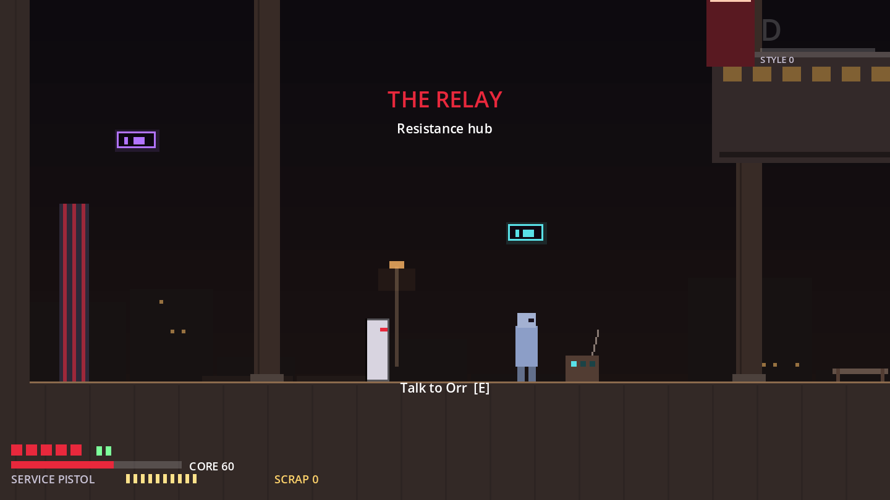
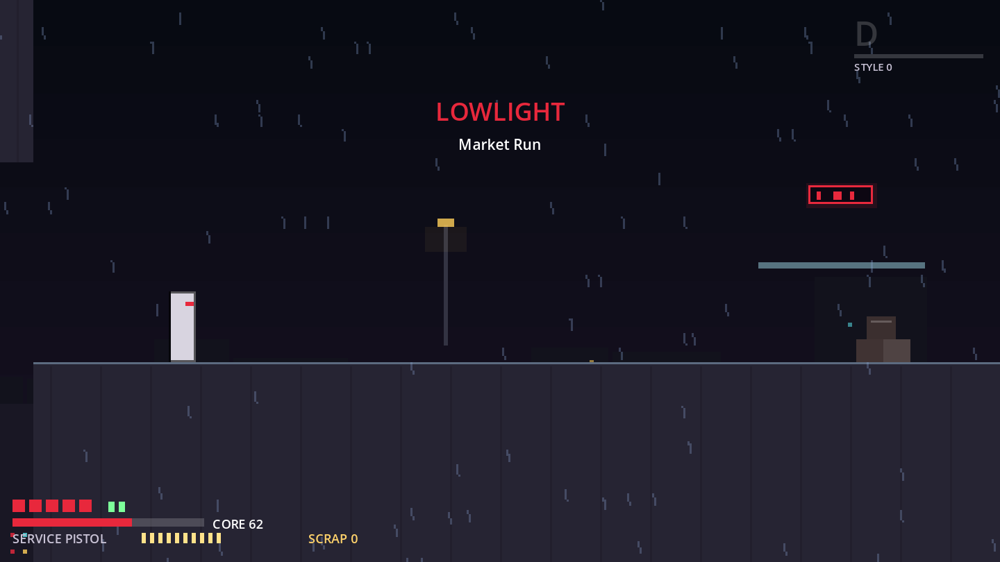
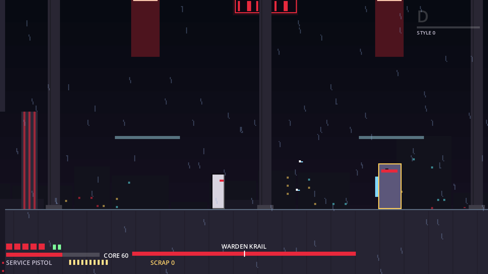
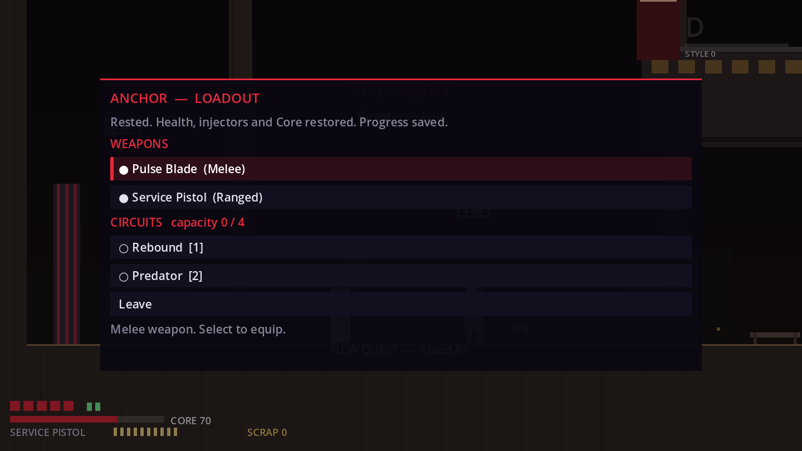
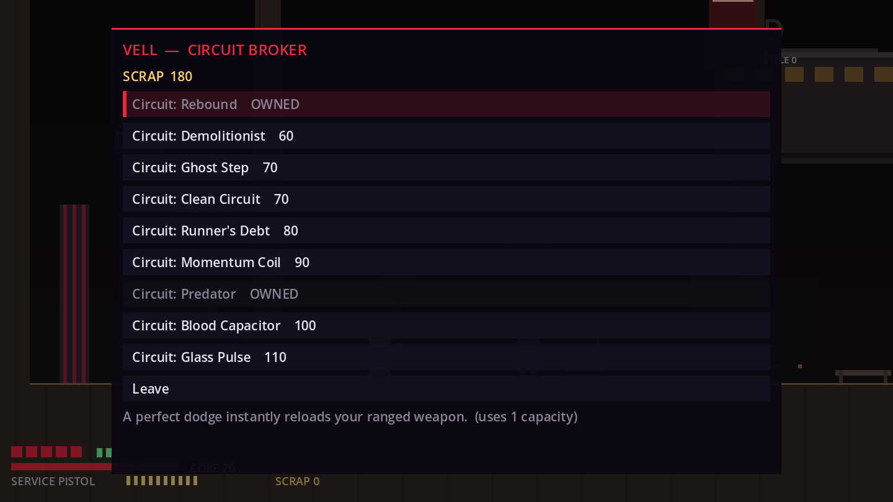
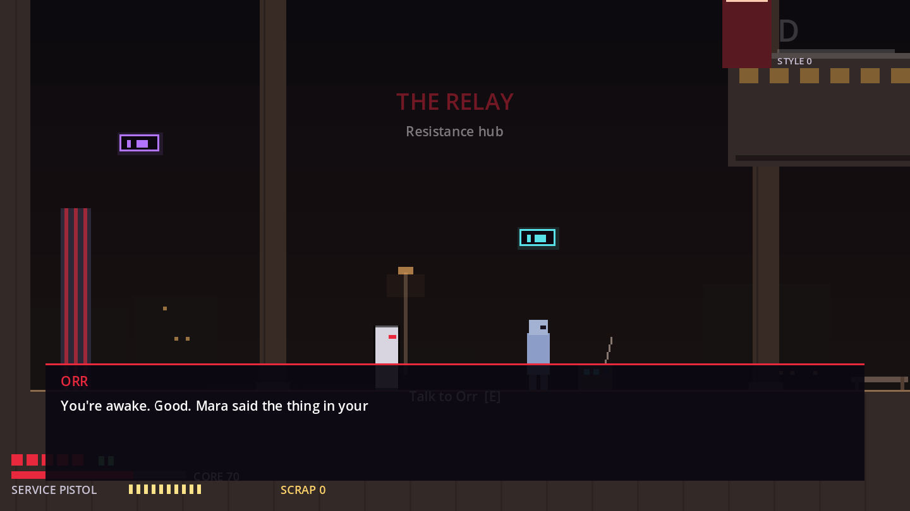
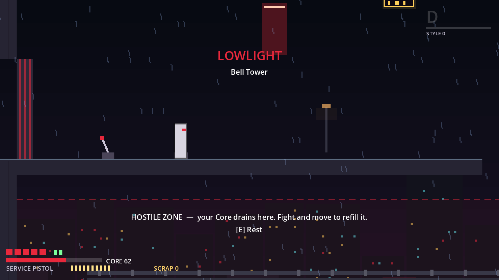
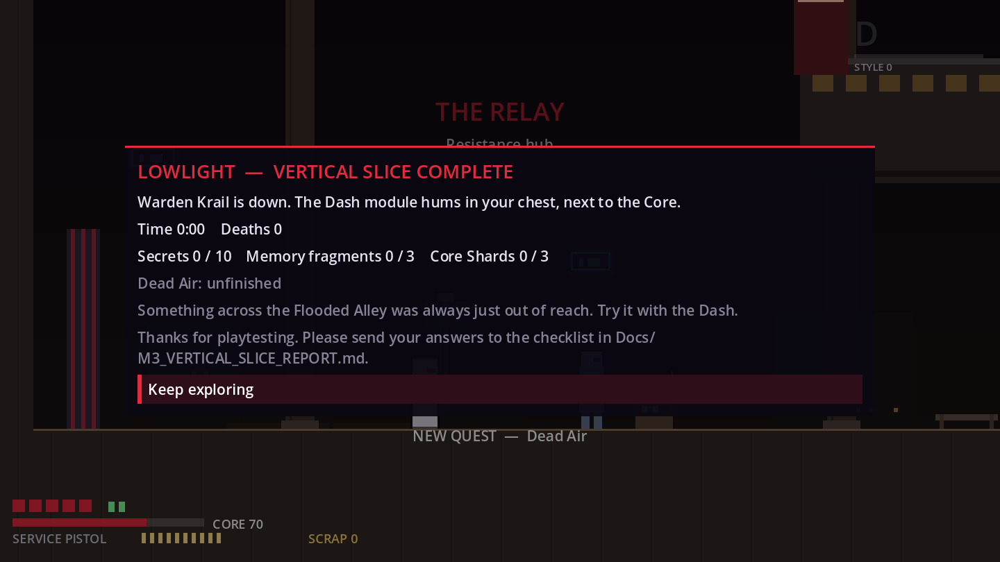

# M3 Vertical Slice Report

**Status:** the M3 systems and a complete, traversal-validated Lowlight route are built: Relay hub → six Lowlight rooms → Warden Krail → Dash. **Development has stopped here for human playtesting (bible §36 M4, §44).** Nothing from M4+ has been started.

> **Important caveat: this is not production art or audio.** The bible says M3 "establishes production-quality art/audio". That can't be produced in this build environment. Everything you see and hear is procedural placeholder work: graybox shapes, `Decor` props, neon signs, a parallax skyline with rain, and synthesized SFX and music stems. What M3 delivers instead is the technical frame that final assets drop into (`Docs/ART_BIBLE.md`), plus every system and the full route at graybox-plus quality. See D-026.

| | |
|---|---|
| Engine | Godot 4.3 stable (GDScript, GL Compatibility) |
| Run it | Open `redline/project.godot` in Godot 4.3+ and press F5. It boots to the title: **New Game** starts the slice, and the labs are still listed there. |
| Route | Relay (hub) → Flooded Alley → Market Run → Apartment Stack → Neon Roofs → Bell Tower → Warden Tower (boss) |
| Content | 7 enemy types (29 placed, plus the boss and its summons) · 5 weapons · 12 Circuits · 1 quest · 10 secrets · 3 NPCs · 3 Anchors |
| Tests | 130 automated (59 new in M3), including a bot that plays every room entrance-to-exit |










---

## 1. Controls (M3 additions)

| Action | Keyboard | Controller (Xbox names) |
|---|---|---|
| Interact (talk, rest at an Anchor, pull levers, open caches) | E | D-pad up |
| Heal (channel while standing still; jump/dodge cancel it, a hit interrupts it; neither uses the injector) | H | LT |
| Pause (resume, journal, settings, save & quit) | Esc | Start / Menu |
| Menus: move / confirm / back | Arrows, Enter / Space, Esc | D-pad or stick, A, B |

All M1/M2 controls are unchanged (J light, I heavy, up + I launcher, O shoot, Shift dodge/dash, Space jump). Prompts show the glyph for the device you last touched (`InputGlyphs`). Dev keys still work: **F1** debug overlay (it now also shows Scrap, Anchor, Circuits, quests and secrets), F4 slow motion, and so on. The Movement and Combat Labs are on the title screen, and F12 cycles them.

## 2. The route (≈ critical path left to right, then up)

| Room | Thesis (bible §41) | What's there |
|---|---|---|
| **The Relay** (hub) | Safe, warm, human | Orr (radio, starts **Dead Air**), Mara (mechanic: gives the Scattergun, sells weapons and an injector upgrade), Vell (Circuit broker: gives Scavenger, sells Circuits). **Anchor.** A locked lift gate (the shortcut from the Bell Tower). |
| **Flooded Alley** | Learn to attack, dodge and slide | Slide under a collapsed awning. The first Needles. A breakable wall hides a tunnel with **Memory Fragment 1**. A Core Shard over a gap that's too wide to jump is visible from the start ("Maybe later": it's Dash-gated). |
| **Market Run** | Shoot, launch into spikes | Stalls and a spike pit for launcher kills. A rooftop detour to **Repeater 1**. A stash behind a breakable wall holds a **Core Shard**. |
| **Apartment Stack** | Vertical climb, first heal | Five floors of 48 px steps. **Repeater 2** in a side room. A mid-climb **Anchor**. A closet wall hides **Memory Fragment 2**. The heal is taught here. |
| **Neon Roofs** | Speed and gaps | A 112 px **slide-jump** gap: missing drops you into a service well with steps back up, never a pip lost. Watchers on sign brackets. A high route with a **dodge-jump** gap to a **Core Shard**. Shields. |
| **Bell Tower** | Vertical gauntlet, elite | Four floors. **Repeater 3** is guarded by the **Enforcer** (an elite). A heavy-only office wall hides **Memory Fragment 3**. The top **Anchor**. A lever opens the lift shortcut back to the Relay. |
| **Warden Tower** | Boss exam | **Warden Krail.** Gates lock during the fight. Winning drops the **Dash** module. The arena is exactly one screen wide, so there are no off-screen hits. |

**Dead Air** (Orr): reactivate the three signal repeaters (Market, Stack, Bell), then report back. The reward is 120 Scrap plus the **Longline** Circuit, and **Emergency Loop** unlocks in Vell's shop. The quest has no objective marker (bible §19): Orr's dialogue and the journal describe where to look.

**After the boss:** the slice-complete card shows time, deaths, secrets, fragments, shards and quest state, and hints at the Dash-gated shard in the Flooded Alley. You can keep exploring afterwards; the lift gets you back to the Relay quickly.

**Length:** with enemies disabled, `RouteBot` crosses every room, secrets included, in **about 2 minutes** of pure traversal. A first-time player with combat, dialogue, shopping, deaths and the boss should take much longer, but **this may land below the bible's ~15–25 min target.** That's the first thing to measure in the playtest (the end card shows the time). If it's short, M4 can decide between adding the remaining Lowlight rooms (Power Block, Security Station, Rainline Chase, Smuggler Route; D-028) and deepening the existing ones.

## 3. Systems

### World framework
- **Rooms** (`Room.world_room`) connect through `RoomExit` → `SceneRouter.transition_to()`: a fade, an entry marker, and carried momentum, so a run through a door stays a run.
- **Persistent state** lives in `GameState` and is saved as JSON (schema **v2**, with migrations from v0 and v1 and atomic writes). It covers health, injectors, core, banked/unbanked Scrap, dropped Scrap, shards, fragments, collected ids, flags, abilities, weapons, Circuits, last Anchor, visited rooms, time and deaths.
- **Anchors** (bible §7) save, fully heal, refill injectors and the Core, bank carried Scrap, set the respawn point, and open the loadout.
- **Death:** a near-instant restart at the last Anchor. Permanent progress is kept. **Carried (unbanked) Scrap drops** where you died as a recoverable cache. Only one cache exists at a time: dying again before you reach it loses the older one (the genre rule). *Settings → Drop Scrap on death: Off* keeps it (the accessibility option from bible §7).
- **Pits** cost one pip and return you to the last *safe* ground: floor with room on both sides, never a ledge lip.

### Items and secrets
- **Scrap:** pickups, caches, enemy drops and the quest reward. There are 3 **Memory Fragments** (lore cards, read again in the journal) and 3 **Core Shards** (each adds +1 Circuit capacity). 4 **breakable walls** (one heavy-only) also count as secrets. **10 secrets** in total, and the counts are computed from the room scenes, so they never drift.
- **Healing injectors:** 2 by default, plus Mara's upgrade. Healing takes time and a hit interrupts it without using up the injector.

### NPCs, dialogue, quest
- NPC dialogue is data (`NpcProfile`): ordered rules that match on flags and pick lines, set flags, or give items. There are no name tags; you learn names by talking.
- **Quests are derived from flags** (`QuestData` stages list the flags they need), so there is no separate quest state that could fall out of sync with the world (D-032).

### Build: weapons and Circuits
- **5 weapons:**
  - **Pulse Blade** (M2).
  - **Split Katars:** fast 4-hit chain, cross heavy, rising launcher, spin air attack and a dive.
  - **Service Pistol** (M2).
  - **Scattergun:** Mara's gift.
  - **Heavy Revolver:** 18 damage, pierces 2, slow and heavy.

  The katars and revolver are bought from Mara.
- **12 Circuits:** see [`CIRCUITS.md`](CIRCUITS.md). Capacity starts at 4 and each Core Shard adds 1. You change your loadout at Anchors. Circuits are declarative data (multipliers and values keyed by stat name), and gameplay code asks `Game.circuit_mult()` / `Game.circuit_value()`.

### Enemies (7 types) and the boss

| Enemy | Role | New in M3 |
|---|---|---|
| Needle, Shield, Scout Drone | Fodder, guard lesson, air threat | Tuned for the slice |
| **Hopper** | Small and fast. Leaps in an arc to hit you. | ✓ |
| **Watcher** | Mounted sentry. Only fires with line of sight. Can't move from its perch. | ✓ |
| **Enforcer** (elite, gold outline) | Follow-up combos, heavier poise | ✓ |
| **Warden Krail** (boss, 520 HP) | Baton 1 → 2 chain, shock lunge, arc burst, ground slam (a jumpable shockwave), backstep | ✓ |

Krail never repeats an attack back to back. At 50% HP he enters **phase 2**: telegraphs 18% faster, and he summons two Needles once. Every opening telegraph is ≥ 0.3 s (validated in data), and his damaging openers stay ≥ 0.4 s in phase 2. The arena gates lock during the fight. Defeating him sets a flag, opens the gates and drops the Dash module, and the fight never restarts once won.

### Presentation (placeholder, see the caveat at the top)
- `DistrictTheme` resources (Lowlight: cold night; Relay: warm rust) drive a procedural parallax skyline, rain, fog, neon signs and props.
- Music: `MusicDirector` renders five synced stems (pad, bass, drums, arp, lead) procedurally at startup on a worker thread. It mixes them by state: explore, flow/combat, boss, hub.
- Menus: title, pause, journal (quests, lore, secrets), settings (shake, hitstop, flash reduction, Scrap loss, core mode, volumes, overlay), loadout, shop and dialogue. All menus are controller-first.

## 4. Acceptance vs the bible (M3 scope, §36)

| Requirement | Status | Evidence |
|---|---|---|
| One polished Lowlight route (~15–25 min) | ⚠️ Route ✅, length unmeasured | Six rooms plus the boss. Every room is bot-validated (`test_slice_routes`). **Length may be short** (§2). "Polished" applies to layout and systems; the art is placeholder. |
| Relay mini-hub | ✅ | Three NPCs, two shops, an Anchor, the quest giver, the lift shortcut |
| 5–7 enemies | ✅ 7 | Needle, Shield, Scout Drone, Hopper, Watcher, Enforcer (elite) + Krail |
| 3–5 weapons | ✅ 5 | Pulse Blade, Split Katars, Service Pistol, Scattergun, Heavy Revolver |
| 8–12 Circuits | ✅ 12 | `CIRCUITS.md`; `test_circuits_shops` |
| One quest | ✅ | Dead Air; `test_dialogue_quests` |
| Secrets | ✅ 10 | Walls, fragments, shards, and a Dash-gated revisit; `test_pickups_secrets`, route tests |
| Warden Krail boss | ✅ | `test_enemies_boss` (phases, no repeats, jumpable wave, arena lock/reward/memory) |
| Production-quality art/audio | ❌ **Not possible here (D-026)** | Art Bible, district themes and replaceable audio hooks are in place for real assets |

### Bible §44 "vertical-slice success test": needs external playtesters
Every §44 item is a human judgement, so none are claimed. §6 turns them into playtest questions.

## 5. Validation and performance
- **Traversal:** `devtools/RouteBot` drives the real player physics with scripted input: run, jump, slide-jump, dodge-jump, dash-jump, slide, interact and attack. `test_slice_routes` plays every room, collects the repeaters and secrets, and exits to the next room. The bot found and fixed five real layout bugs:
  - 55 px climbs against a 56.4 px jump;
  - a pole that walled off Neon Roofs;
  - a scaffold you bonked on;
  - blocked dash platforms;
  - an unreachable stash.

  It also found a pit-respawn-on-lip loop that could chain into a death.
- **Structure:** `test_slice_world` checks that every exit links to a real entry and back, that every spawn lands on clear ground, that persistent ids are unique, that Anchors have spawns, and that the boss room is wired.
- **CPU (headless wall time per frame, `PerfProbe --room=…`, fighting at 3 spots, 1800 frames):**

| Room | avg | p95 | p99 | max |
|---|---|---|---|---|
| Relay | 0.99 ms | 1.61 | 2.23 | 8.80 |
| Market Run | 1.47 ms | 2.03 | 2.87 | 6.00 |
| Neon Roofs | 1.52 ms | 2.22 | 3.08 | 6.74 |
| Warden Tower (boss) | 1.34 ms | 2.02 | 2.96 | 6.08 |
| Combat Lab (M2 reference) | 1.22 ms | 1.74 | 2.42 | 5.26 |

All are well inside the 16.7 ms budget. GPU cost and real-hardware FPS are **not** measured (K-2).

## 6. Playtest checklist (please send answers back)
Play from **New Game** to the end card, with keyboard or a controller (ideally both across two runs). Please don't read §2 first.

1. How long did it take (end card time)? How many deaths, and where?
2. Did movement feel immediately satisfying? Where did it feel bad?
3. Did you understand what the Core (red bar) wants from you in the hostile zones?
4. Did you ever want to replay a room to do it more stylishly?
5. Was combat readable? Were you ever hit by something you didn't see coming?
6. Which enemy do you remember most, and why?
7. Are you curious about Veyra, Rook or the Memory Fragments?
8. Which secrets did you find or notice? Did any feel unfair or invisible?
9. Can you explain the Circuit system in one sentence? Which Circuits did you equip?
10. Did Warden Krail feel fair? How many attempts did it take? Which attack killed you most?
11. Did you get lost anywhere, or not know where to go next?
12. The Neon Roofs slide-jump gap: did you make it? How many tries? Did the service well feel OK?
13. Did the placeholder music get annoying? Did any sound help or hurt?
14. Do you want to keep playing after the slice?

## 7. Known issues and open questions
See `KNOWN_ISSUES.md` (K-22 onward) and the flagged decisions D-026 to D-037 in `DECISIONS.md`. The big ones:
- Placeholder art and audio (D-026).
- The route may be shorter than 15–25 min (D-028).
- The slide-jump beats a run-jump by only about 8–15 px under the M1 tuning, so its "teaching gap" can't be a hard gate (D-036).
- There's no map or fast travel yet; that's bible M5 (D-033).

## 8. How to verify locally
```bash
cd redline
godot --headless --import                                          # once after cloning
godot --headless --fixed-fps 60 res://tests/TestRunner.tscn        # 130 tests; exit code 1 on failure
godot --headless --fixed-fps 60 res://tests/TestRunner.tscn -- --filter=slice_routes   # just the route bot
godot --headless --fixed-fps 60 res://devtools/PerfProbe.tscn -- --room=res://world/rooms/lowlight/NeonRoofs.tscn --at=600:-102,1060:-102,1850:-92
xvfb-run -a godot --fixed-fps 60 --rendering-driver opengl3 res://devtools/CaptureTour.tscn -- --out=/abs/dir --tour=slice   # or --tour=ui
```
