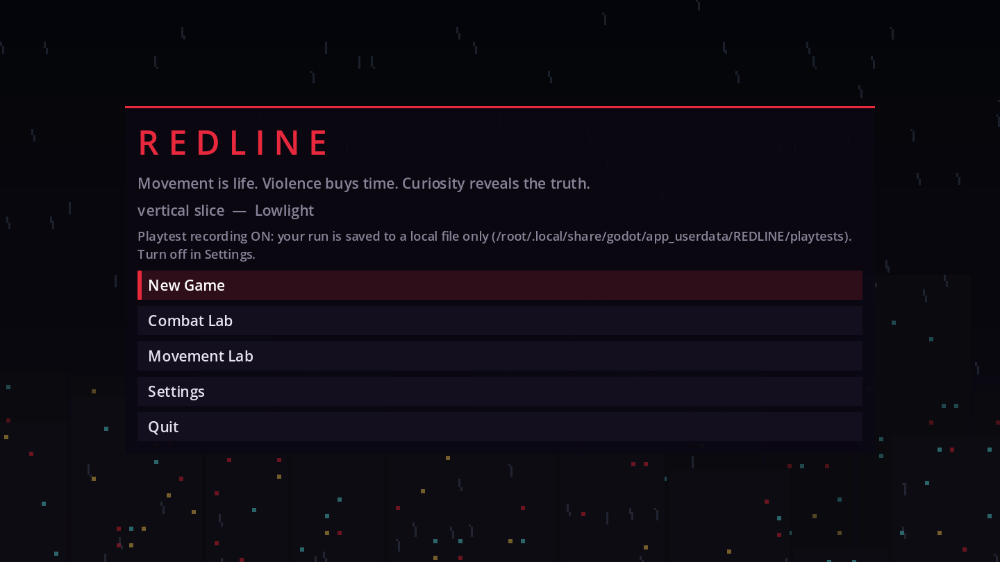
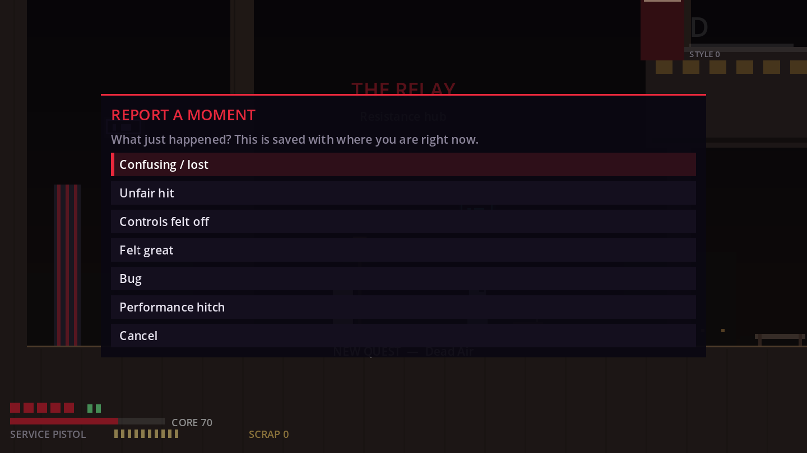
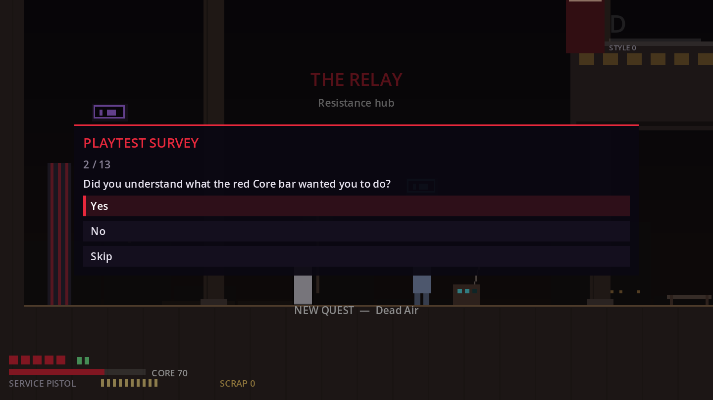
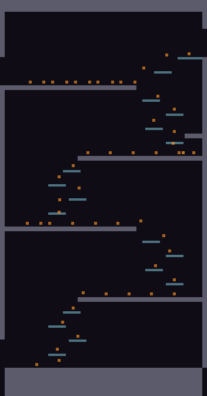

# M4 Validation Report

**Status:** the M4 *measuring equipment* is built. The game records every playtest session locally, testers can flag moments and answer a §44 survey in-game, and one command turns a folder of sessions into a report with heatmaps. There's also a playtest kit and one live design experiment. **The measurement itself needs external human testers, so M4 isn't finished until they've played** (D-038). Nothing from M5 onward has been started.

| | |
|---|---|
| Bible §36 M4 | "Playtest and measure deaths, completion time, confusion, favorite mechanics, control complaints and performance. Change design before scaling." |
| Run a playtest | Follow [`PLAYTEST_KIT.md`](PLAYTEST_KIT.md) |
| Build the report | `godot --headless res://devtools/PlaytestReport.tscn -- --in=<sessions> --out=<report>` |
| Tests | 146 automated (16 new in M4) |

---

## 1. What each M4 measurement comes from

| Bible M4 asks for | Recorded in the game | Shown in the report |
|---|---|---|
| **Deaths** | Every death and hit, with its cause (`enemy/attack`, hazard, pit, burnout), room and position | Deaths by room, by cause, damage by cause, pit falls, boss attempts and clears, red × on the heatmaps |
| **Completion time** | Session clock (unpaused), room entry and exit with dwell time, slice-complete stats | Completion and session length (median, min, max), time per room |
| **Confusion** | Position every 0.5 s, re-entered rooms, hints shown, pauses, "Report a moment → Confusing / lost", survey "got lost" | Idle spans (standing still ≥ 20 s), re-entries, moment notes placed on the map, heat density |
| **Favourite mechanics** | Hits per attack, which map to weapons; shots per weapon; kills per enemy; style peak per room; purchases; final loadout; survey "favourite" and "most memorable enemy" | Tables for each |
| **Control complaints** | "Controls felt off" moments with notes, survey "controls did what I meant", time on controller vs keyboard | Controls section |
| **Performance** | The **real** frame time of every frame on the tester's machine, in a histogram and per room, plus spikes > 33 ms, GPU, OS and refresh rate | Histogram, per-room avg/max/spikes, hardware list |
| **§44 success test** | 10 survey questions, one per §44 line | Scorecard: share passing per criterion; PASS needs ≥ 6 of 10 met at ≥ 60% of testers (D-041) |
| **"Change design before scaling"** | An experiment arm, recorded per session | Variant comparison (completion, deaths, movement score) |

## 2. Privacy and safety
- Session files are written to the tester's own machine (`user://playtests`) and **never sent anywhere**. There's no networking code in the project.
- The title screen says recording is on, and shows where the files go. *Settings → Playtest recording* turns it off, which stops the current session.
- The files contain no names, accounts or free text apart from the notes the tester types into "Report a moment".
- The recorder only listens to EventBus and reads the player's position. Gameplay never depends on it, and every M3 test still passes with it installed.

## 3. The live experiment: slide-jump strength (D-036)
The one open design question that data can settle is how strong the slide-jump should be.

| Arm | What changes | Measured in Neon Roofs by the route bot |
|---|---|---|
| `baseline` | Nothing (the shipped M1 tuning) | Clears the 112 px gap **only** when the slide starts about 14 px before the lip. Starting 28–40 px early falls into the well. |
| `strong_slide_jump` | `slide_jump_bonus` 30 → 60, `slide_jump_height_ratio` 0.8 → 0.9 | Slides starting up to **40 px early** still clear it. A plain run-jump from the lip **still falls short**. |

So the strong arm turns the gap into a real, forgiving slide-jump gate, and a test locks that in. Whether it *feels* better, and whether it breaks other rooms, is for the testers to say. Auto mode alternates arms per session; facilitators can pin one in Settings. Only one experiment runs at a time, because with 5–8 testers every extra arm halves the data (D-042).

## 4. Validation of the tooling
- **Recorder:** tests cover rooms, damage and death causes, the frame histogram, position samples, the atomic file write, recording-off meaning no file, variants applied to a copy only, variant rotation, moments, the survey and pass rules.
- **Menus:** the moment and survey menus open, pause, save and close; the survey is walked end to end.
- **Analyzer:** hand-built sessions with known numbers check deaths by room and cause, pits, re-entries, idle spans, completion, variants and scorecard thresholds (2 of 3 happy testers pass, 1 of 3 doesn't). The Markdown sections and heatmap pixels (a death cross where the death was) are checked too.
- **End to end:** a real RouteBot run is recorded to a file, then the report and heatmap are built from it.
- **Synthetic sample:** the route bot recorded 9 sessions across the slice to check the report's layout, including the Bell Tower heatmap above. Those sessions are **bot data, not evidence**: no deaths, no survey, no human hesitation.

## 5. Acceptance vs the bible (M4)

| Requirement | Status |
|---|---|
| Measure deaths, completion time, confusion, favourite mechanics, control complaints, performance | ✅ Instrumented and reported. ⏳ Needs real sessions. |
| Playtest | ⏳ **Needs external humans.** The protocol, script, interview and note sheet are in `PLAYTEST_KIT.md`. |
| Change design before scaling | ⏳ The decision rubric maps each failing §44 criterion to data files. The first experiment is ready. **Design changes wait for the results.** Making them now would be guessing. |

## 6. What to send back
The folder of `session_*.json` files, plus the facilitator note sheets. With those I can build the report, propose data changes for each failing §44 criterion and each hotspot (flagged in DECISIONS, as always), make them, and prepare the next round.

## 7. Known issues
- K-30: Frame timing is wall-clock per rendered frame. It includes vsync waits, so a 60 Hz display shows about 16.7 ms even when the game has plenty of headroom. Read the spike counts and 33 ms+ buckets, not the averages, as the "stutter" signal.
- K-31: Idle-span detection can't tell reading a lore card or thinking from being lost. Cross-check with the moments and your notes.
- K-32: The Warden Tower's first frames after a room load include one-off loading spikes (one 55 ms frame in the bot run). Single spikes on room entry are expected; repeated ones aren't.
- K-33: A session that ends by crashing keeps everything up to the last autosave (every 20 s, and on every death).
