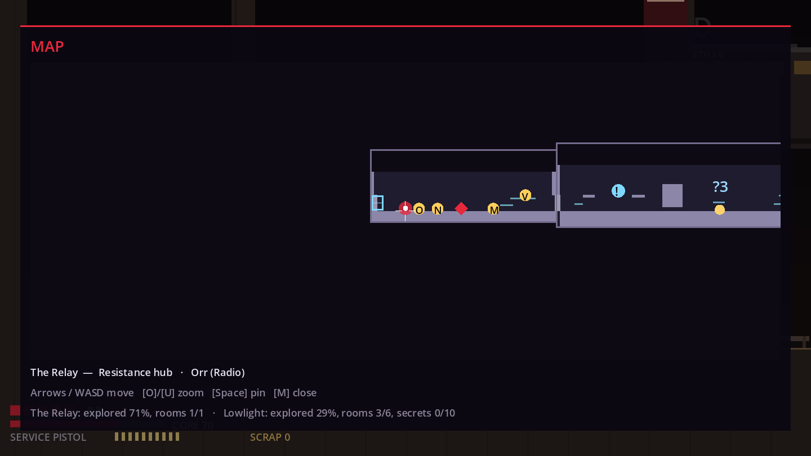
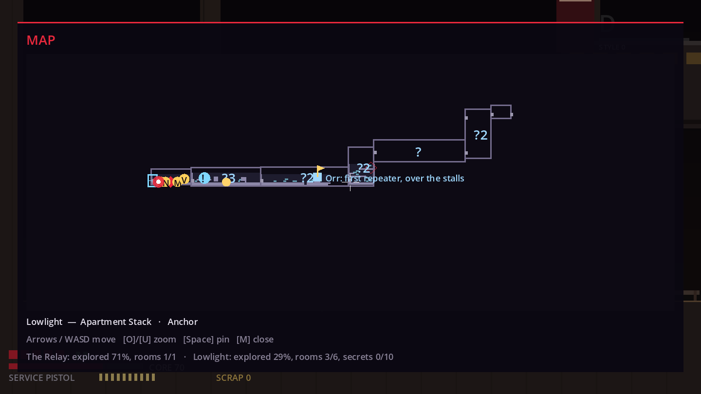
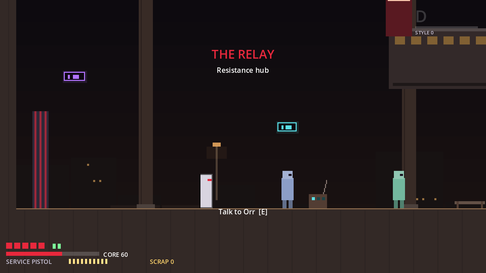

# M5 World Framework Report

**Status:** the M5 framework (bible §36 M5) is built and tested: map, fast travel, quests, NPC state, shops, economy, journal, collectibles and save migration. It runs on the existing Lowlight slice plus one new NPC (Nix). **Flag:** M5 was started, at your request, before the M4/§44 human playtest (D-044). Nothing from M6 onward has been started.

| | |
|---|---|
| Bible §36 M5 | "Map, fast travel, quests, NPC state, shops, economy, journal, collectibles and save migration." |
| New controls | **Map: M / pad View.** In the map: move = pan, O/U (RB/LB) = zoom, Space (A) = pin, M or back = close |
| Tests | 166 automated (20 new in M5) |

---

## 1. What each M5 item is

| M5 item | What exists now | Bible |
|---|---|---|
| **Map** | Fog of discovery per 64 px cell; room outlines once visited or once Nix's base map is bought; detail only where you've been. Icons: Anchors (filled = on the transit network), NPC pins, discovered bosses (crossed out when beaten), unresolved gates and ability gates, quest map notes, player pins (12), the dropped Scrap cache, transit lines, Rook. District completion (explored %, rooms, secrets). | §20 |
| **Fast travel** | Nix sells a **transit pass**. After that, every Anchor you've rested at is a destination from any other Anchor's menu. Arriving counts as resting there. | §7, §13 |
| **Quests** | Still derived from flags. New: reward flags, map notes per stage, and a second quest, **Chart Lowlight** (explore 70% of Lowlight, report to Nix; 100 Scrap + the Surveyor's lens). Fixed a double payout. | §19 |
| **NPC state** | Talk counts per NPC (`talks_<id>`). Dialogue rules take conditions such as `atleast:talks_nix:4`, `ability:dash` and `collected:<id>`. **World consequences:** the Relay gets a restored radio mast after Dead Air, Krail's banner after the boss, and Nix's city map after the survey (`WorldStateSwitch`). | §13, §19 |
| **Shops** | Nix, the cartographer, joins Mara and Vell: base map 40, transit 60, lens 90. | §13 |
| **Economy** | `EconomyAudit` computes sources against sinks from the data, with tested targets. Secrets now pay (see below). | §12 |
| **Journal** | Adds district completion. Quests, memories and stats were already there. | §20 |
| **Collectibles** | Scrap stashes inside secret spots. The Surveyor's lens shows *that* a room still hides something, never *where*. | §20, §21 |
| **Save migration** | Schema **v3**: explored-cell bitsets (base64), pins, Anchors rested. v2 → v3 migration: old saves keep their room outlines, and their respawn Anchor joins the transit network. | §29 |

## 2. How the map stays honest
- **No hand-kept icon lists:** `WorldMapIndex` reads Anchors, NPCs, gates, exits, secrets, bosses and markers straight from the room scenes. Move an Anchor and the map follows.
- **Layout is data** (`data/world/world_map.tres`: one offset per room). A test proves that every exit lands on its target's entrance on the map; I checked the test by deliberately misaligning a room. Another test checks that rooms don't overlap. Lifts are declared as transit links and drawn dashed.
- **The map rewards exploring rather than replacing it** (bible §20): buying the base map shows outlines only; geometry, Anchors and gate symbols appear only in cells you've actually explored.

## 3. Economy (details in [`ECONOMY.md`](ECONOMY.md))
- **Finding:** a thorough first run earned 546 Scrap against 1,570 of shop stock, so **35%** was affordable, because secrets paid nothing.
- **Fix:** breakable walls now hold Scrap, and four secret spots carry stashes, giving 926 Scrap, which is **59%** of the stock.
- **Tested:**
  - a first run covers 45–85% of the stock;
  - the essentials (base map and transit, 100 Scrap) are affordable early;
  - a full enemy re-clear pays at most 15% of the stock (enemies respawn, so farming is possible but slow).

## 4. Telemetry (M4 tie-in)
The playtest recorder now logs map opens, pin changes and fast travel. The report adds "map opened, by room". Many opens in one room suggest players aren't sure where to go.

## 5. Acceptance vs the bible (M5)

| Item | Status | Evidence |
|---|---|---|
| Map with fog, pins, vendor pins, Anchors, transit, bosses, gate symbols, secret hints, completion stats | ✅ | `test_world_map` (11 tests), captures |
| Fast travel | ✅ | `test_transit_between_rested_anchors` (travels and arrives at the Anchor) |
| Quests | ✅ | Chart Lowlight flow, reward flags, map notes; double-payout fix |
| NPC state | ✅ | Talk counts, condition rules, world-state switches |
| Shops / economy | ✅ | Nix's shop; `test_economy` targets |
| Journal / collectibles | ✅ | Completion line; stashes; lens hints |
| Save migration | ✅ | v3 round trip through JSON; v2 → v3 migration test |

## 6. Needs a human
- **Map readability and controls** on a real screen and controller: pan speed, default zoom, icon legibility.
- Whether transit should need a pass at all, or come free with the first Anchor (D-047).
- Economy numbers: whether 59% feels generous or stingy (D-049). The M4 report's purchases table will show it.
- **Still open from M4:** the §44 slice playtest itself. The M5 features are recorded too, so one round covers both.

## 7. Known issues
See `KNOWN_ISSUES.md` K-35 to K-39. The main ones:
- The map redraws every visible cell every frame. That's fine at 7 rooms, but it should be cached once there are many districts.
- Transit starts only from Anchor menus, not from the map.
- The room layouts were produced with a generator script that isn't in the repo (the `.tscn` files are the source of truth, editable in Godot). M6's content pipeline should add real room tooling.
