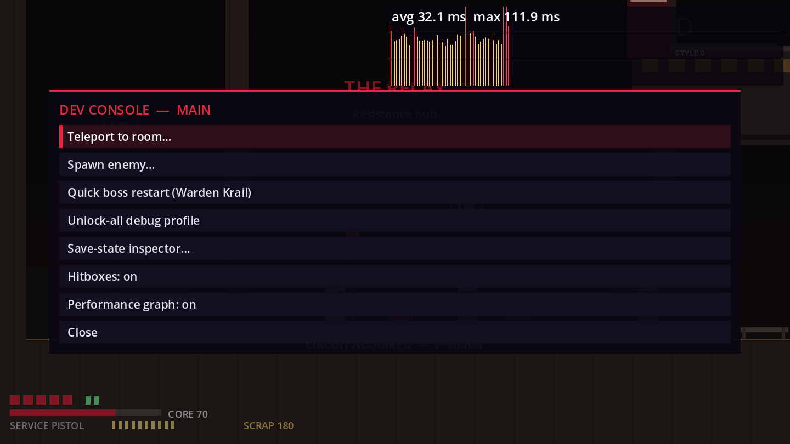
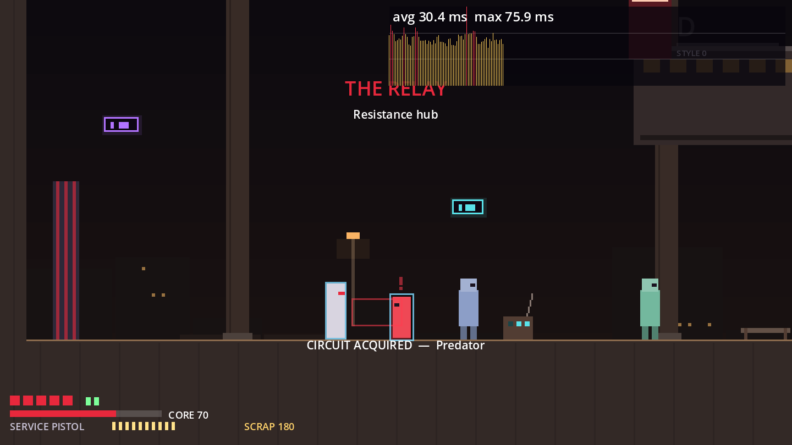

# M6 Content Pipeline Report

**Status:** M6 (bible §36: "editor/dev tools, reusable enemy modules, room templates, art pipeline and validation") is built and tested. The how-to guide is [`CONTENT_PIPELINE.md`](CONTENT_PIPELINE.md). **Flag:** like M5, this was built before the §44 human playtest (D-053). Nothing from M7 onward has been started, and no slice content was added. The one new enemy is a pipeline test and isn't placed in any room.

| | |
|---|---|
| Tests | 189 automated (23 new in M6) |
| New dev key | **`** (backquote): dev console, debug builds only |
| New commands | `ValidateContent.tscn` · `MovementProbe.tscn -- --write-metrics` · `python3 tools/roomgen/lowlight.py [--check]` |

---

## 1. What each M6 item is

| M6 item | Built | Proof |
|---|---|---|
| **Validation** | `ContentValidator` covers: broken-reference scanner, every data resource's `validate()`, room metadata lint, quest/dialogue flag lint (required but never set), collectible tracker, and the Art Bible checks. It has a CLI with an exit code. | 0 errors across all scripts, scenes, data and the 7 rooms. I checked that deliberate mistakes (a missing entry, an unknown hint action, a dangling flag, a bad condition) are reported. |
| **Room templates** | `GapChallenge`, `ClimbSteps`, `Doorway` and the `JumpArcPreview` gizmo, all driven by **jump arcs recorded from the real player** (`TraversalMetrics`). | The route bot clears each gap with its technique, and the weaker technique fails (the run-jump drops into the slide gap's catch well). Steps are climbable, and too-tall steps warn. A test flags stale metrics when movement tuning changes. |
| **Room tooling** | `tools/roomgen/` is the generator behind the Lowlight rooms, now in the repo (was K-39), with `--check` for drift. | Regenerating is byte-identical. |
| **Reusable enemy modules** | `EnemyBrain` = movement + ordered attack rules + guard + looks. Six enemies moved from bespoke scripts to data brains; the six scripts are deleted. | **Parity:** every combat, enemy, route and boss test passes unchanged. CPU is unchanged (1.55 ms average). The **Signal Drone** is built from data alone and tested. |
| **Art pipeline** | `SpriteSheetSpec` / `SpriteAnim` / `SpriteActor`. Enemies and Rook switch from placeholder to sprite through data. `ArtValidator` enforces the Art Bible. `assets/` holds the conventions. | Generated fixture sheets: a good one passes and is cut into frames; bad names, soft alpha, odd sizes and overruns are rejected. An enemy and Rook both play `idle` from a sheet. |
| **Editor/dev tools** (bible §34) | Dev console: teleport-to-room, unlock-all profile, quick boss restart, enemy spawner, save-state inspector, hitbox visualization, performance graph. | `test_dev_tools` (6 tests); screenshots above. |

Tools from the §34 list that already existed: spawn markers, Flow Zone boundaries (debug grid), traversal validation (RouteBot, M3), weapon debug (F9 ranged cycle, F3 tuning panel) and the debug overlay (F1).

## 2. Things the pipeline caught while it was being built
- **GapChallenge's first formula was about 6 px too optimistic.** It assumed take-off with the centre half a body past the lip. The route bot's slide-jump fell into the well, so the formula now assumes take-off *at* the lip.
- **RouteBot released jump at the apex**, losing the apex-hang gravity and about 10 px of distance compared with a player holding the button. It now holds jump until landing. All slice routes and the D-036 experiment still pass.
- The validator flagged a stale data file from an intermediate step, which was removed.
- **Traversal metrics in `data/movement/` broke the preset list** (the F6 preset cycle and the preset validator scan that folder). They moved to `data/level/`.

## 3. Acceptance vs the bible (M6)

| Item | Status |
|---|---|
| Editor/dev tools | ✅ Dev console with all six §34 items that were missing; editor templates and gizmo |
| Reusable enemy modules | ✅ 6 of 7 enemies on modules (the boss stays bespoke by design); data-only proof enemy |
| Room templates | ✅ 3 templates + preview, metric-driven, bot-proven |
| Art pipeline | ✅ Spec → swap-in → validator; waiting for real art (D-026) |
| Validation | ✅ One gate: `ValidateContent` plus the test suite |

## 4. Needs a human
- **Try the templates and the jump-arc gizmo in the Godot editor.** Baking, rebuilding on property changes and the configuration warnings are editor behaviour; the tests only cover the logic.
- Is backquote a good console key on your keyboard layouts? It's a physical key, so it sits in the same place on any layout.
- The §44 playtest is still open (M4). The M5 and M6 work doesn't change the slice's feel, apart from the M5 Scrap stashes and Nix.

## 5. Known issues
K-40 to K-43 in `KNOWN_ISSUES.md`. In short:
- Templates are only exercised in the editor by a human, not by tests.
- The generator is Python, a dev-only dependency.
- The dev console is available in any debug export.
- Rook's sprite swap-in maps movement states only; combat-specific animations follow the attack ids when real art defines them.
