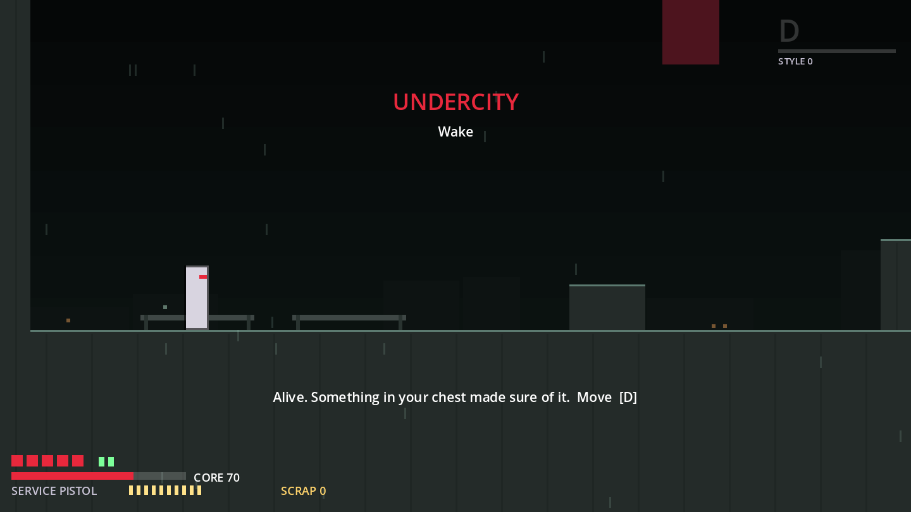
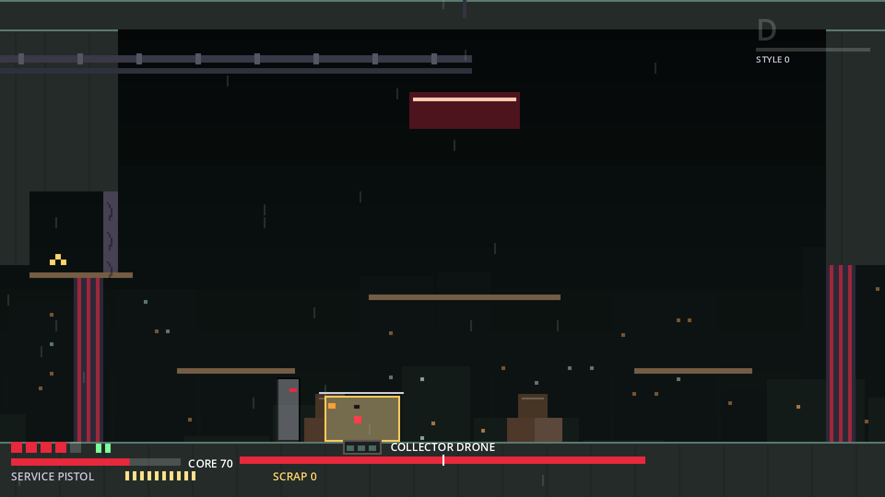
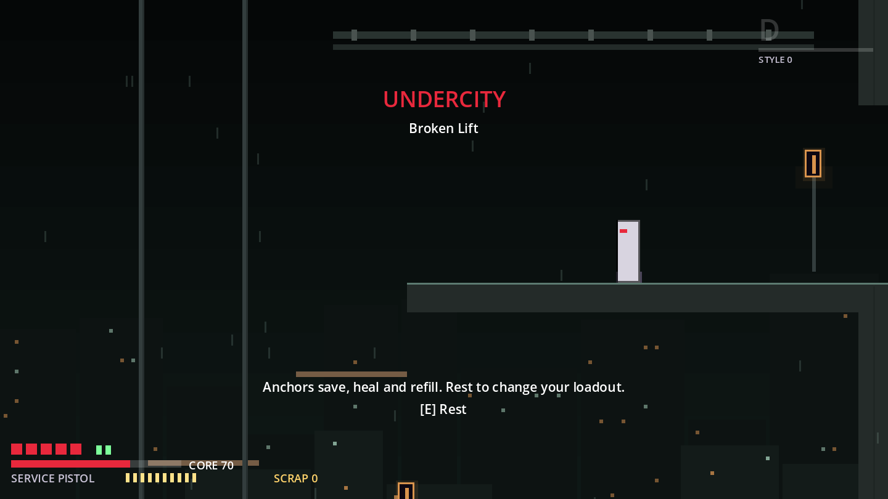
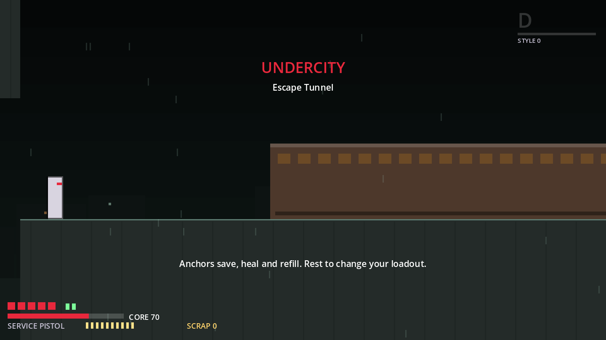
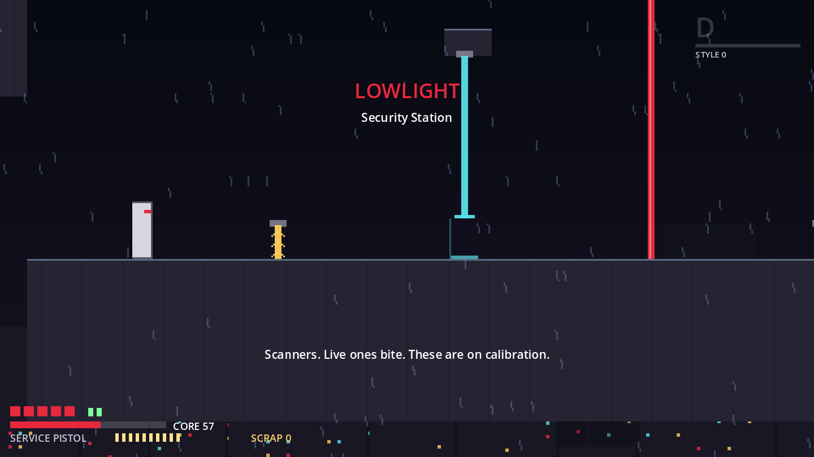
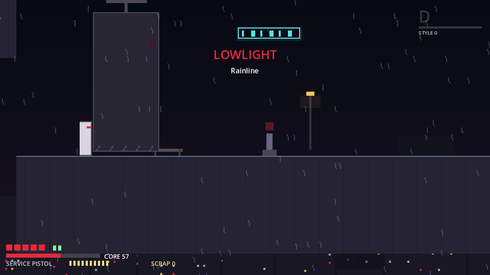

# M7 District Production Report (batch 1: Act I)

**Status:** M7 batch 1 is built and tested. Bible §36 M7 says: "Build regions in batches. Every district requires a mechanic thesis, visual thesis, enemy ecosystem and boss test." Batch 1 is Act I: the new **00 Undercity** (the game's real opening, bible §42) and the completed **01 Lowlight**. The district sheet with the four lines per district is [`DISTRICTS.md`](DISTRICTS.md). **Flag:** like M5 and M6, this was built before the §44 human playtest, because you asked for it (D-061). Ironworks and every later district (batch 2+) are **not started**.

| | |
|---|---|
| Version | `0.7.0-m7` |
| Tests | 415 automated (226 new in M7), 0 failed |
| Rooms | 11 new (7 Undercity, 4 Lowlight); 6 existing rooms re-plumbed (Relay, Flooded Alley, Apartment Stack, Neon Roofs, Bell Tower, Warden Tower) |
| New Game | Starts unarmed in Undercity/Wake (`data/world/onboarding.tres`, D-062) |
| Content gate | `ValidateContent` 0 errors, 8 warnings (flags read only by code); every room generator matches its scene (`--check`) |
| Decisions | D-061 to D-104 (`DECISIONS.md`), the flagged ones in §5 below |

Screenshots from `CaptureTour --tour=undercity` and `--tour=slice`. The tours start from the debug full kit, so the HUD shows the Service Pistol and the Core bar even in Wake; a real New Game has neither there.

---

## 1. What was built, per §36 M7 item

### 00 Undercity: Wake → Medical Ruin → Maintenance Shaft → First Pursuit → Broken Lift → Collector Bay → Escape Tunnel → the Relay

| M7 item | Built | Proof |
|---|---|---|
| **Mechanic thesis: *Keep moving*** | The Collector eye (`CeilingTracker`, D-069) rides First Pursuit's ceiling and bolts a Rook who stands still for 1.0 s in its cone. Flow Zones drain the Core while Rook lingers (Broken Lift FZ1 at half drain and floored at 1; Escape Tunnel FZ3 at full drain), and hits refill it. No spikes or pits (D-067). | `test_tracker` (11), `test_first_pursuit_eye`, the `pursuit_mid` checkpoint test; `test_fz1_pace`, `test_fz1_challenge_floor` (30 s idle in Challenge ends at Core 1, no burnout); `test_fz3_pace` per Core mode |
| **Visual thesis: a flooded civic disposal complex** | Sea-green flickering tubes for ambience, sodium lamps on the route only, red only on the Collector, cyan only on Orr's radio, concrete/rust/steel geometry, seepage rain (`undercity_style.py`, `undercity.tres`, Art Bible §3). A broken sea-green tube (`NeonSign.broken`: askew, half lit, stuttering) marks each secret wall, the Collector Bay vent included; ambient tubes never use it (D-104). Landmarks per room (DISTRICTS.md). | The undercity tour runs clean (17 shots). Reviewed against the thesis: red appears only on the Collector's grate, hatch and drone; the landmarks read (tram, lift car, arena). At tour framing the sea-green tubes are small and dim, so the district reads mostly as dark concrete. That is a placeholder-art judgement for a human (§6). |
| **Enemy ecosystem** | Needle (the first melee enemy, with a dormant 0-Scrap practice copy), Scout Drone (the dodge teacher), Hopper (vertical pressure), Watcher (the pistol teacher). No Shield or Enforcer; no new variants. The first composition (Needle + Scout Drone) is on Maintenance Shaft Floor 2 (D-089). | Room route tests per room; `test_shaft_first_composition` (blade only, two strings each); `test_escape_tunnel_route` kills the Watcher with three diagonal pistol shots |
| **Boss test: the Collector Drone** | A 400 HP card-deck boss (Drop Press, Tag Volley, Claw Dive, Hook Sweep) in its own arena, scaled as the §42 first mini-boss (D-064, D-079). The Drop Press locks where Rook stands, in the eye's cone language, so it tests the district's thesis up close. It drops the Service Pistol at (252, 0), which the next room teaches; the way out opens only once the pistol is taken (D-100). The Drop Press tests the eye half of the thesis, not the Core (D-101). | `test_boss_collector` (15, including a blade `BossBot` win in about 26 s), `test_collector_bay_*`, the live `quick_boss_restart('collector_drone')` test |

The walk as a whole: `test_full_undercity_walk` starts from the shipped New Game and walks Wake to the Relay balcony with each room's own route, carrying the state from door to door. It proves that each room is entered with exactly the kit the rooms before it hand out, that the main path never needs Dash or an Anchor rest, and that the walk charts the Undercity. The Collector fight is skipped there (the flag is set at the arena door); the boss has its own tests.

### 01 Lowlight: + Power Block, Security Station, Rainline Chase, Smuggler Route

| M7 item | Built | Proof |
|---|---|---|
| **Mechanic thesis: *The Grid*** (D-071) | `Breaker` → latching `PowerShutter` (countdown, 24 px slot, safety sensor). Power Block introduces, reinforces and combines it on four floors; the Smuggler Route pump room and the Security Station roof reuse it. Security Station adds `ScannerBeam`s (calibration, then live, then on a breaker circuit; D-072). The Rainline adds the Sweeper chase (`ChaseDirector`, D-073). | `test_power_shutter` (14), `test_power_block_route` (all five latches, pass margins, S4b low), `test_pb_slot`, `test_pb_safety_sensor`; `test_security` (11) and the Security Station tests; `test_chase` (14) and 14 `test_rainline_*` tests |
| **Visual thesis: rain-slick neon over sodium streets** | The existing Lowlight palette, plus the Transformer Core (red arcs, cyan after the reroute), cyan scanner lanes and red strobes at the Monitor Wall, the storm-lit Rainline, the floodgate and violet smuggler marks. | The slice tour runs clean (32 room shots plus the boss shot). The D0/D7 shot diff: new shots for every new room and entry, renamed `s_NeonRoofs_from_power` and `s_BellTower_from_rainline`, changed Relay and Apartment Stack shots. |
| **Enemy ecosystem** | The existing roster (Needle, Shield, Scout Drone, Hopper, Watcher, Enforcer); no new variants. The new pressure is environmental. | Route tests with enemies pacified; `test_economy` (the re-clear rule, K-49) |
| **Boss test: Warden Krail's Grid Clamp** | Two high breakers arm a clamp over the Warden Tower's centre. It drops a poise-breaking environmental hit on Krail, and teaches itself once: "Breakers live. Drop the clamp on him." The breakers are out of every grounded swing's reach (D-095). Krail drops Dash at `reward_position` (208, 0), on the floor (D-077). | `test_boss_grid_clamp` (8), `test_warden_tower_clamp_in_room` (every grounded swing with both melee weapons from each one-way end, then a jump + air light) |

The walk as a whole: `test_full_lowlight_chain` goes from the Relay balcony to the Warden Tower through every critical-path room. The loops are tested too: the Smuggler hatch both ways, the old-save route from the Bell lift west through Security Station into the Power Block basement (D-075), and Iko moving from the den to the Relay (D-076).

### Supporting systems
- **Onboarding:** `OnboardingConfig`, the unarmed start, weapon pickups, the hidden Core HUD (D-081), pre-Anchor entry respawn (D-063), `EntryCheckpoint` (D-088), and a v3 save fixture that still loads and walks into the Undercity (D-087). `test_onboarding` (24).
- **Story and economy:** Orr's radio, the intake terminal, the crew note, Iko; The Way Up quest; two fragments; Iko's stock (+660 sinks); Core Shards 3 → 5; secrets 10 → 22 (D-082). Final audit: one-time 1,772 Scrap, coverage 79%, re-clear 332 of 334 (`ECONOMY.md`).
- **Playtest:** the Undercity timeline, separate Krail and Collector lines, the Lowlight-time line, district set-piece tables, and the survey's Collector/eye/Sweeper choices plus an unscored `collector_fair` (`PLAYTEST_KIT.md`).
- **Pipeline:** one generator per room, fixture generators, the content protocol, `test_door_contracts`, the shared route harnesses, and `CaptureTour --tour=undercity` (`CONTENT_PIPELINE.md`).

## 2. Things the tests caught while it was built
- **Air swings were a hidden super jump.** Every air swing reset the fall speed, and a light on the jump frame kept the grounded swing's half gravity (56 → 87 px). Chained lights outreached a dash-jump, so no Dash gate could hold. Air swings now hang only when they connect (D-093). This changes air combat feel everywhere, so it is flagged.
- **Dash gates at one height leak.** A dodge-jump plus a late air dodge reaches about 229 px against the dash-jump's 242. The Smuggler shrine and the Flooded Alley shelf now sit 64 px below their take-offs, and the sweeps test every air-dodge frame and late take-offs (D-094). Escape Tunnel's gate still uses the older, narrower sweep (K-48).
- **A spawn inside an exit fired the exit.** The player entered the physics space at the room origin for one step, so Collector Bay's west door bounced both spawns back to Broken Lift. `Room.gd` now positions the player before adding it (D-091).
- **The plan's numbers didn't always add up.** The interim chart threshold (0.34, not 0.46), the final thresholds (Undercity 0.40, Lowlight 0.50, from measured coverage), the secret count (22, not 20), the Collector's cruise lane (x ≥ 84), and the Apartment Stack hatch target (`from_stack`) were corrected against the code (D-064, D-080, D-082, D-092).
- **The Collector eye's lock rule** could not both forgive short stops and warn fairly. It now builds only while Rook stands still (D-069).
- **Room layouts:** the route tests moved a few pieces (Wake's solid sill, Broken Lift's car roof, Rainline's coupler step and signal-box back wall) and exposed that the specs placed props by their top instead of their bottom-centre origin (D-098).

## 3. Estimated pacing against §42
These are **estimates** from the room specs (a human's first run, deaths included), summed low / mid / high. Nothing here is measured yet: the Undercity timeline in the playtest report measures it (K-45, D-083).

| §42 item | Where | Minute (low / mid / high) | §42 band | Verdict |
|---|---|---|---|---|
| Move, jump, interact | Wake | 0–3 | 0–5 | ok |
| Simple attack (Pulse Blade) | Medical Ruin rack | 1.8 / 2.5 / 3.3 | 0–5 | ok |
| Dodge | Maintenance Shaft | 5.8 / 7.8 / 9.8 | 5–15 | ok |
| First composition | Maintenance Shaft Floor 2 | 7 / 9.5 / 12 | 5–15 | ok |
| First secret | Maintenance Shaft closet | 7.5 / 10 / 12.5 | 5–15 | ok |
| First NPC (Orr's radio) | First Pursuit | 13 / 18.25 / 23.5 | 15–30 | early at the low end, accepted (D-083) |
| Core introduced safely | Broken Lift FZ1 | 14 / 19.25 / 24.5 | 15–30 | early at the low end, accepted (D-083) |
| First Anchor | Broken Lift `uc_lift` | 15.5 / 21.5 / 27.5 | 15–30 | ok |
| First mini-boss | Collector Bay | 15.6 / 21.6 / 27.6 (win 17 / 24.75 / 32.5) | 15–30 | ok |
| **The Relay** | Escape Tunnel exit | **19.5 / 28.25 / 37** | 30–60 | high ok, mid 1.75 min early, **low 10.5 min early** |
| **Dash** | Warden Tower (Krail) | **43 / 59.5 / 76** | ~60–90 | mid and high ok, low early |

The Smuggler Route loop adds about 3–5 min before Krail (Dash at 46 / 63.5 / 81). The old 15–25 min slice target now compares with the report's "Lowlight time, Relay arrival → slice_complete" line, not the whole run.

**Reading:** fast players will reach the Relay early. If the measured median Relay arrival is under about 25 min, deepen Medical Ruin and First Pursuit first (D-083).

## 4. Acceptance vs the bible (M7, batch 1)

| Item | Status |
|---|---|
| Mechanic thesis per district | ✅ Undercity "Keep moving" (the eye, Flow); Lowlight "The Grid" (breakers, shutters, clamp) |
| Visual thesis per district | ✅ written and applied in placeholder art (`DISTRICTS.md`, Art Bible §3); final art waits for D-026 |
| Enemy ecosystem per district | ✅ per-district rosters, one concept at a time in the Undercity, no new variants |
| Boss test per district | ✅ the Collector Drone (tests the thesis via the Drop Press); Krail's Grid Clamp |
| §41 introduce / reinforce / combine / test | ⚠️ Lowlight in order. The Undercity introduces the eye and the Core, but its combine beat (Escape Tunnel FZ3) plays after the Collector, which tests only the eye (D-101, flagged) |
| §42 onboarding timeline | ⚠️ in band at the mid and high estimates; fast players early (D-083); unmeasured until the playtest |
| §14 loops and shortcuts | ⚠️ Lowlight: Bell lift, Smuggler hatch, latching shutters, the quiet Rainline, the Relay gallery door, the old-save route. The Undercity is a strict line, revisited through `uc_lift` transit and the Relay balcony (D-102, flagged) |
| Main path never needs an unowned ability | ✅ `test_full_undercity_walk` and `test_full_lowlight_chain`; Dash-only paths are optional secrets |

## 5. Flagged decisions (please confirm or overrule)
- **D-061** M7 before §44 (process).
- **D-062** The Undercity is the opening; the start is unarmed.
- **D-063** Pre-Anchor deaths respawn at the last room entry, in every district.
- **D-068** Which build the §44 playtest uses. "Slice (Relay start)" exists only in debug builds, while playtests should use release exports (K-58). **Needs a human.**
- **D-072** Scanners respect dodge i-frames (spikes still don't, D-020).
- **D-073** One chase system; catches are nonlethal; no `timing_assist`.
- **D-074** Rainline G3 keeps a 112 px slide-jump on the main path.
- **D-075** The Smuggler Route is optional and played 5th, not 8th.
- **D-076** Iko moves from the den to the Relay.
- **D-079** The Collector Drone is the §42 first mini-boss; Krail stays the §44 "first boss".
- **D-101** The Undercity's §41 combine beat comes after its boss, and the boss tests only the eye.
- **D-102** The Undercity has no loop or shortcut.
- **D-082** Core Shards 5 (capacity 9), secrets 22, fragments 5.
- **D-083** Pacing: fast players reach the Relay about 10 min early.
- **D-085** Challenge mode burns in Escape Tunnel's FZ3 after about 11 s.
- **D-087 / D-090** No save schema bump for new optional keys (amends the old CLAUDE.md rule).
- **D-093** Air swings hang only when they connect (combat feel).

## 6. Needs a human
- **Run the §44 playtest** (`PLAYTEST_KIT.md`), and decide the build first (D-068). It now covers the Undercity timeline, both bosses, the shutters and the chase.
- **Feel checks** the tests can't make: does the Collector eye still feel threatening now that only standing still builds its lock (K-54)? Is the Collector fight long enough (a bot wins in 26 s, K-56)? Does air juggling still feel good after D-093? Do players bump their heads under Power Block's shaft lips (D-098)?
- **Art direction:** look at the undercity tour against the visual thesis. The sea-green tubes are dim at gameplay framing, SEA sits near healing green (K-46), and the seepage rain may read as weather (K-47).
- Confirm or overrule the flagged decisions in §5.
- Batch 2 (Ironworks) starts only when you ask, ideally after the playtest. The economy has 2 Scrap of re-clear headroom, so it needs new sinks before new enemies (K-49).

## 7. Known issues
K-44 to K-60 in `KNOWN_ISSUES.md`. In short:
- Rainline G3 inherits the slide-jump's small margin (K-44); the Undercity pacing is estimated (K-45).
- Escape Tunnel's Dash gate is swept less thoroughly than the others and probably leaks to a perfect dodge-jump + air dodge; the Smuggler shrine can be reached with a coyote-end take-off (K-48).
- The re-clear rule has 2 Scrap of headroom (K-49); `test_fz3_pace` has almost no margin in Normal (K-51).
- Power Block's S4b low pass reads as a close call in the report (K-52).
- Placeholder art: banners carry no text, and Orr's Escape Tunnel radio floats (K-53).
- RouteBot pitfalls for room authors (K-57); hint lines can outlive their room (K-59); headless runs print leak warnings on exit (K-60).
