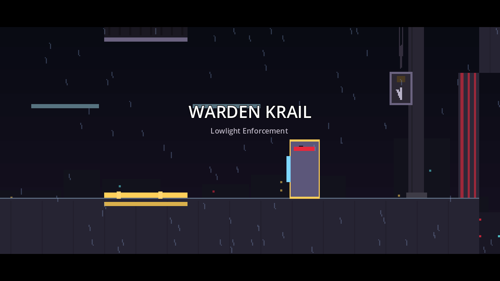
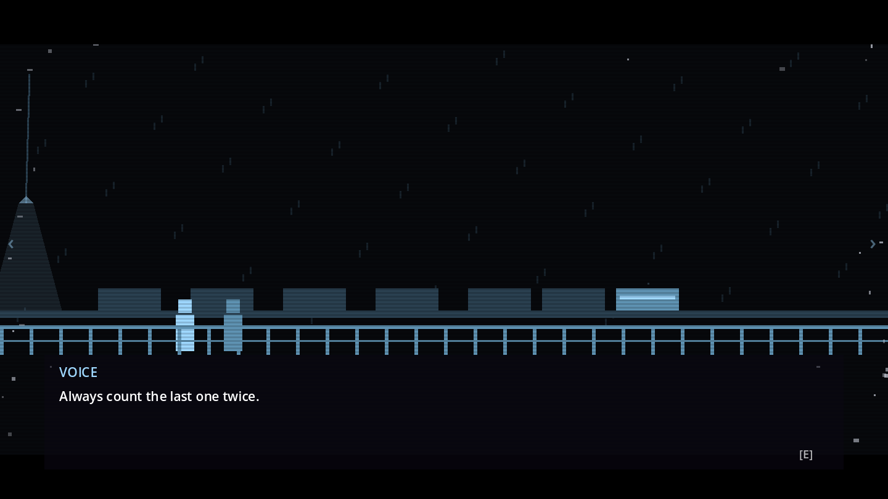
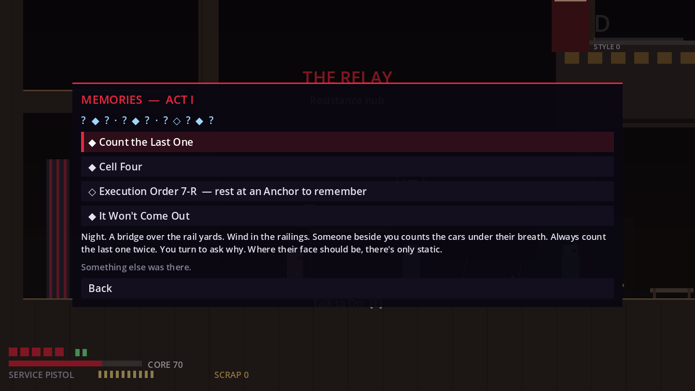
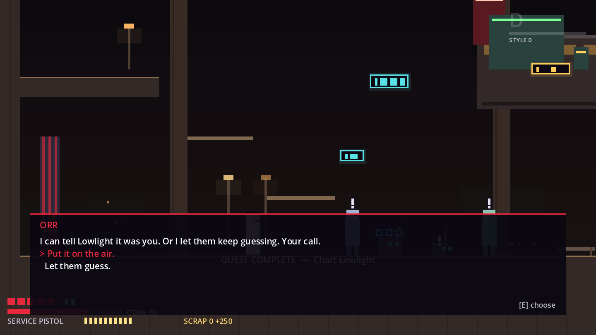
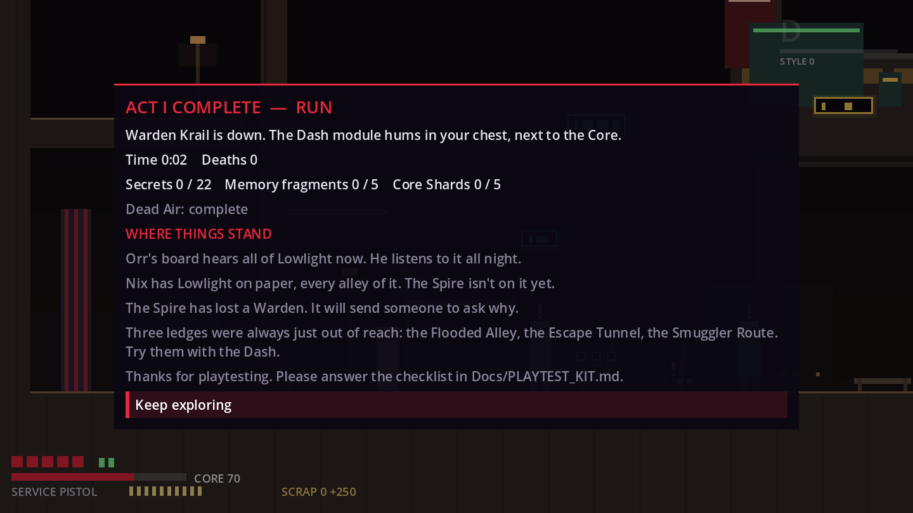
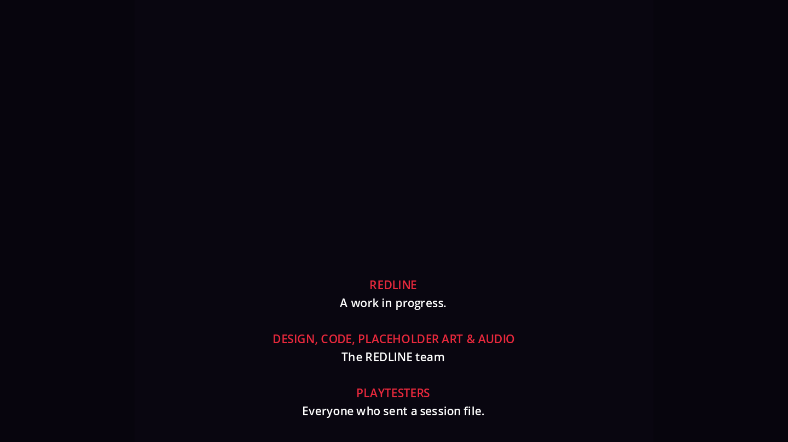

# M8 Narrative Integration Report (systems + Act I)

**Status:** the M8 batch is built and tested. Bible §36 M8 says: "Narrative Integration: cinematics, memory scenes, NPC arcs, endings and world-state changes." Acts II–V, their districts and the finale do not exist, so this batch builds the five narrative **systems** fully and integrates them into Act I (00 Undercity, 01 Lowlight, the Relay). The endings are a complete framework with four placeholder sequences and a credits roll, reachable only through the dev Ending theatre and tests; their real conditions are data that Act I play cannot satisfy (D-105). **Flag (process):** like M5–M7, M8 was started before the §44 human playtest, because you asked for it ("START M8", D-105).

| | |
|---|---|
| Version | `0.8.0-m8` |
| Tests | 607 automated (192 new in M8, 7 of them from the audit repair), 0 failed |
| Content gate | `ValidateContent` 0 errors, 10 warnings: the future-flag summary, the one expected knowledge-lint hit (`orr.tres` "Rook", D-109) and the 8 pre-existing "read only by code" flags. Every room generator matches its scene (`--check`) |
| Tours and perf | `CaptureTour` movement 7, combat 5, slice 33, ui 13, undercity 17 and story 51 shots, all clean. `PerfProbe` (headless CPU, fight load): Relay avg 0.71 ms, p99 1.36 ms; Warden Tower avg 1.08 ms, p99 1.73 ms |
| Save | No new `GameState` key, schema still 3; all M8 state is flags (D-116) |
| Decisions | D-105 to D-139 (`DECISIONS.md`), the flagged ones in §5 below |

Screenshots from `CaptureTour --tour=story` (51 shots, list in §3). The tour starts from story presets with the debug kit, so the HUD shows the Service Pistol and the Core bar everywhere.

---

## 1. What was built, per §36 M8 item

| M8 item | Built | Proof |
|---|---|---|
| **Cinematics** | One data-driven sequence system (D-106): `SequenceData` step lists in `data/sequences/` run by the new `Cinematics` autoload, with letterbox, camera, actor moves on placeholder figures, lines with speaker labels, waits, fades, flag sets, music and sfx cues, title cards and credits. Input locks during a locking scene; nothing locks during danger (`SequenceTrigger` waits for active enemies). **Skippable:** a tap advances a line, a hold of `cinematic_skip` skips (0.8 s first view, 0.4 s repeat), or two taps under "Press twice", or PauseMenu **Skip scene** (D-108). **Pause-able.** Subtitle size, background, speaker labels and speed on a "Subtitles & scenes…" page (D-110). Skips are recorded (`seq_end`). Act I scenes: the Wake opening, the Collector and Krail intros (first attempt full; retries are 0.8 s non-locking overlays that keep control), the Relay arrival and the Act I close before the card; plus three non-locking radio barks. Headless runs resolve every scene instantly (INSTANT), so RouteBot and every walkthrough stay byte-stable (D-107). | `test_sequences` (22: INSTANT same frame, skip parity, hold vs tap, mash and Resume presses never skip, pause freezes, room leave aborts, subtitle speed, menu gating), `test_act1_sequences` (23: every Act I scene validates and skips to the same end state, never moves Rook, the opening only from the `start` spawn, repeat intros never lock, a quit mid-close replays, the close then the card, the trigger waits for enemies), `test_m8_foundation_ui` (SkipGate, settings, subtitle geometry, pad A/B) |
| **Memory scenes** | Memory Fragments become playable vignettes (`MemorySceneData`, `data/memories/`): a panning tableau in memory blue with neutral edge static, 3–6 player-paced beats and one hidden detail to find (D-115). They surface **at Anchors, one per rest, never on pickup** (D-112); the journal's gallery replays them on a timeline strip and offers "Remember now" (D-114, D-138). The vignette has its own pause panel (Resume / Skip memory / Subtitle size). Act I set: the five existing fragments plus one surfaced memory, "Count the Last One", on the first Anchor rest, so a first-time player sees the system once before the Collector (D-113). A skip still counts as remembered. | `test_memory_scenes` (25: one scene per fragment with verbatim quotes, pending order and the per-rest cap, INSTANT never hangs, hold skips without advancing, detail dwell, flash reduction, the pause panel, Anchor then loadout, pickup never pauses, journal replay and fit) |
| **NPC arcs** | `NpcArc` (an ordered spine plus unordered reactions, sticky, derived from flags) and `ArcTracker`, a `QuestTracker` sibling (D-117). Act I arcs for **Mara, Vell, Nix, Orr and Iko** react to both bosses, Dead Air, the chart, memories (Rain Clinic, the Ledger, Cell Four) and each other; seven `thread_*` flags seed later acts. Consequences show through people and places, never a meter (§18): a pending-beat tick over NPCs (D-120), the journal's People page, Relay props and one choice, Orr's on-air beat after the close (D-118). Arc dialogue gives nothing (D-122). | `test_npc_arcs` (30: sticky stages, story rules win over beats, a skipped beat still counts, old saves catch up quietly, each arc's Act I path, both Orr outcomes, both Iko paths, economy neutrality, choice mode on keyboard and pad, the tick and journal notes) |
| **Endings** | `EndingData` + a pure `EndingResolver` + `EndingDirector` (D-126), four endings from §18 (Sever, Crown, Release, hidden Redline) as short placeholder sequences with a credits roll. Memory and NPC requirements are data (`requires_memories`, `requires_arcs`). `FutureFlagSet` makes them unreachable by construction until their acts exist (D-127). The dev Ending theatre plays them in a flag sandbox (D-128). Plus an **"Act I complete" beat**: `act1_close`, `act1_complete` and the card "ACT I COMPLETE — RUN" with up to three "where things stand" lines (`ActData`, D-131). | `test_endings` (16: unreachable from the Act I max state and the v3 save, each reachable when satisfied, priority, Release needs memories and arcs, the theatre leaves the profile untouched, real play marks seen even when skipped, overlay-only budgets, paraphrase-only text, the card header and lines) |
| **World-state changes** | The Relay changes with progress: the gallery door lamp, Orr's repeater pips, the lit train, Iko's stall, a door watch after the close, Vell's sign, four arc props, Mara's post at the alley door after the close and a bodiless radio board with new chatter (D-123). Undercity and Lowlight rooms react to the bosses, Dead Air, the reroute, Iko, the Cell Four memory and Orr's choice; three map notes use `MapMarker.NOTE` (D-124); hub music layers are data (D-125). Every switch is visual only (linted). The full list is `DISTRICTS.md` "World state". | `test_world_state` (12: the switch contract, children visual only, exclusive pairs, the Relay per preset, arc props, Mara's exclusive posts, the Relay routes under `act1_complete`, props clear of spawns, the radio board and its cue, map notes, barks non-locking) |

### Supporting work
- **Save** (item 7 of the brief): seen sequences, arc stages, memories viewed and endings seen are all flags; a pre-M8 save with `slice_end_seen` gains `act1_complete` on load (D-116). `test_save_manager` pins the `GameState` key set and loads the M7 v3 fixture with M8 defaults.
- **Validation:** the resource content protocol (`content_flags()` / `content_check()`, `check_resource()`), sequence rules (budgets at subtitle speed Normal, actors, no Rook moves, only `SeqFlag` sets flags), memory/arc/ending/act/credits rules, `count:` conditions (D-119), the visual-only switch lint, the Act I knowledge lint (D-132) and a "## Story" section in the content report (D-133). `CONTENT_PIPELINE.md` "Story content" is the how-to.
- **Tools:** the DevConsole "Story…" pages (sequence, memory and Ending theatres, story presets, arcs, boss intro replays), `SequenceInspector`, DebugOverlay ACT/SEQ lines, `StoryTestKit` and `CaptureTour --tour=story`.
- **Playtest:** the recorder logs sequences (first view, locked, step, skipped), memories, arc stages, the choice and endings; the report gains a Story section with first-view skip rates (a warning above 50%) and a "minus cinematic_s" timeline column (`PLAYTEST_KIT.md`).
- **Controller parity:** `cinematic_skip` is on pad A with the jump keys, and `ui_accept` / `ui_cancel` now include pad A / B, so every menu works from a controller for the first time (D-111).

## 2. Things the tests and reviews caught while it was built
- **A skip must never lose an effect, and an abort must never keep one.** A skip (and INSTANT) runs every remaining step's `finish()`; an abort (room left, Save & Quit, test teardown) runs none, sets no flag and restores, so the scene replays. Actor moves and flashes are reverted on abort so non-locking repeat intros stay safe (D-106, K-M8-24).
- **Taps and holds had to be exclusive.** Mashing jump through the opening used to risk skipping it. A tap now only advances, a skip is a hold, and presses carried in from before a scene (entry mash, Resume, a menu key) are ignored (D-108). `test_first_view_mash_keeps_lines`, `test_resume_press_does_not_skip`.
- **Repeat boss intros take no control at all**, instead of being skippable: §17 asks for "fast restart" as well as skippable repeats (D-108, FLAG).
- **INSTANT boss intros moved the camera** by about one pixel, which broke M7's byte-identical boss frame; the INSTANT path now leaves the camera alone (D-107).
- **Exported builds list `.remap` files,** so a plain `.tres` directory filter would silently drop memories, speaker labels and the card in a release export. Every M8 runtime scan goes through `DataDir` (K-M8-22).
- **A JSON round trip turns ints into floats,** which re-fired flag signals on load; `set_flag` now ignores numerically equal writes (D-116).
- **A legacy (v3) save** gets `act1_complete` on load and would have lost Orr's legacy radio call; the post-Act-I radio rule also needs `met_orr_radio` (D-123).
- **Canon guards:** the Act I close's band line shares no sentence with Execution Order 7-R (test-enforced), the Cell Four marks are the tapper's, never Rook's own hand, and no Act I text ties memories to the Core (D-115, D-134).
- **The post-build audit** found the knowledge lint skipping map labels, journal notes and speaker labels; an aborted Act I close keeping `act1_complete`; triggers that gave up while another play ran; direct damage under a locking scene; a hidden interact prompt after scenes; memory flags not saved after a rest; hard-coded scene timings; and leaked resources at exit. All are fixed (CHANGELOG "Audit repair"); three canon seeds in hidden details and radio text are now flagged in D-134.

## 3. CaptureTour --tour=story (51 PNGs)
Run: `xvfb-run -a -s "-screen 0 1600x900x24" godot --fixed-fps 60 --rendering-driver opengl3 res://devtools/CaptureTour.tscn -- --out=/abs/dir --tour=story`. It plays each Act I scene, the memories and the endings, then applies each story preset (`data/dev/story_presets.tres`) for the Relay and room shots.

| Group | Shots |
|---|---|
| Act I scenes | `st_opening_eye`, `st_collector_title`, `st_krail_title`, `st_act1_card`, `st_act1_trophy` |
| The Act I card | `st_act1_card_menu`, `st_act1_card_menu_no_dead_air` |
| Memories | `st_mem_first_rest_title`, `st_mem_first_rest_beat3`, `st_mem_first_rest_tear`, `st_mem_uc01_detail`, `st_mem_ll04_flashreduce`, `st_journal_gallery` |
| The Relay per preset | `st_relay_fresh`, `st_relay_collector_down`, `st_relay_relay_met`, `st_relay_repeaters_2`, `st_relay_dead_air_done`, `st_relay_grid_rerouted`, `st_relay_charted`, `st_relay_krail_down`, `st_relay_act1_complete`, `st_relay_arcs`, `st_relay_pending_tick`, `st_relay_pan` |
| Rooms before/after | `st_wake_collector_mark_before/_after`, `st_collector_bay_before/_after`, `st_flooded_alley_posters_before/_after`, `st_security_b1_before/_after`, `st_bell_floor4_before/_after`, `st_warden_tower_before/_after` |
| Dialogue | `st_choice_box`, `st_dialogue_size2`, `st_bark_bell_lift_prompt` |
| Endings | `st_ending_<sever/crown/release/redline>_title` and `_credits` |
| Tools and settings | `st_ending_theatre_page`, `st_inspector`, `st_settings_subtitles` |

Seen while reviewing the shots: `st_act1_card_menu_no_dead_air` is byte-identical to `st_act1_card_menu` (the tour's `set_flag("dead_air_complete", false)` is re-derived by `QuestTracker`, so the "still deaf" line never shows, K-M8-37). Queued HUD hints from applying a preset ('QUEST COMPLETE — Dead Air', 'QUEST COMPLETE — Chart Lowlight', 'CIRCUIT ACQUIRED — Longline') can show in the room and Relay shots (K-M8-29). The four `_credits` shots are identical by design (one credits roll).

## 4. Act I first-time pacing
Nominal first views at subtitle speed Normal (the `ValidateContent` story table): the opening 17.0 s, the Collector intro 8.2 s, the Relay arrival 11.7 s, the Krail intro 12.6 s and the Act I close 23.2 s. That is **about +73 s of locked scenes** on a first campaign run (the plan estimated ~75 s), plus **about 20–30 s** for the first-rest memory at `uc_lift`. **Repeat boss intros cost 0 s of control** (non-locking 0.8 s overlays), and every scene can be skipped with a hold. Against M7's estimates (Relay at 19.5 / 28.25 / 37 min, Dash at 43 / 59.5 / 76) the opening, the Collector intro, the arrival and the first-rest memory move the Relay arrival about 1 min later on a first run, and Dash about 1.2 min later: the low and mid Relay estimates and the low Dash estimate stay below their §42 bands, as accepted in M7 (D-083); M8 moves them about 1 min closer. Subtitle speed Slower doubles line time (opt-in, K-M8-18). The §44 report measures it: first-view skip rates per scene, `cinematic_s`, and the timeline's "minus cinematic_s" column (D-135: if first-view skips pass 50%, cut the opening to its two lines).

## 5. Flagged decisions (please confirm or overrule)
- **D-105** Scope: systems + Act I integration, endings unreachable until Act V. **Process flag:** M8 started before the §44 playtest (CLAUDE.md: "Do not start … any later district or milestone unless the user asks"), because you asked.
- **D-108** Skip is always a hold and a tap only advances; repeat boss intros never take control instead of being "skippable" (§17).
- **D-109** M8 never names Rook, but `orr.tres` dialogue `orr_report` does ("And Rook - don't go up that tower tired.") while `mf_lowlight_04` says he came in without a name. The on-air choice, the "Fourteen" designation, a pronoun in `mf_undercity_01` and the §44 survey's `curious_world` question all hang on the same decision. **Needs a human.**
- **D-110** Six settings pulled forward from M9's accessibility menu; text auto-advance stays M9.
- **D-113** The surfaced first-rest memory invents a companion and a bridge and is not recovered from the city.
- **D-114** The memory timeline order (it implies the Core predates the arrest).
- **D-115** Memory blue full-screen inside vignettes; Core red only on redacted shapes.
- **D-118** Rook's first words are choice labels; the only Act I choice sits after the card, so §44 players who stop at the card never see it.
- **D-120** The pending-beat tick vs §19 "no giant objective markers".
- **D-129** Ending thresholds and their links to missable Act I content are placeholders.
- **D-130** Redline needs The Null, scheduled for M9.
- **D-131** The Act I boundary (Undercity + Lowlight, ending at Krail) and the card header become canon.
- **D-134 / D-137** Arc canon commitments and placeholder ending text. A3's "Later act" notes are not canon.
- **D-135** First-time pacing grows by ~73 s of locked scenes.
- **D-136** No pause menu over a DialogueBox conversation or Orr's choice (M9); vignettes have their own pause panel.
- **D-138** The memory gallery lives in the journal, not with Sera (§13).
- **D-139** The story needs the Undercity campaign start; the debug Relay start plays no opening or arrival (decide with D-068).

## 6. Needs a human
- **Run the §44 playtest** on the Undercity campaign start (`PLAYTEST_KIT.md`, D-068, D-139). Observers now also note the opening, the intros, the arrival, the close, the first-rest memory and the new card header.
- **The manual first-time windowed run** from the M8 gate could not be made in this headless session: Wake → Relay → Krail → card; the opening plays; first-view intros skip only with a 0.8 s hold while a tap advances a line; a Krail or Collector retry keeps control; journal and dev replays skip with a 0.4 s hold; the close, then the card and the survey button. On a pad: every menu (pause with "Skip scene", Subtitles & scenes, the gallery and People, the DevConsole Story pages, the vignette pause panel) with A and B; Orr's choice on D-pad Up only moves the cursor while E confirms; the first Anchor rest shows the "[E]" cue.
- **Decide Rook's name** (D-109) and review the canon commitments (D-113, D-114, D-134, D-137) before any Act II writing.
- **Feel checks:** is ~73 s of first-time scenes too much (D-135)? Does hold-to-skip read without explanation? Do players find the hidden memory details? Does the pending tick read as "someone has something to say"?
- **Art direction:** the Relay's cyan budget with the repeater pips (K-M8-10), the memory palette and the placeholder ending cards (D-026).
- **Smoke-test an exported build** before the playtest (K-M8-22).
- Acts II–V, the finale and Ironworks start only when you ask, ideally after the playtest.

## 7. Known issues
K-M8-1 to K-M8-39 in `KNOWN_ISSUES.md`. In short:
- First-time pacing grows (K-M8-1); a pad player who holds A 0.8 s still skips a first view (K-M8-2); Subtitle speed Slower doubles line time (K-M8-18).
- No pause menu while a DialogueBox conversation or Orr's choice is open; the tree is paused, so nothing progresses (K-M8-19, D-136).
- Exported builds must be smoke-tested for `.remap` scans (K-M8-22).
- `SliceEndTrigger` has no theatre guard (K-M8-28). (The ungated `take_damage` paths, K-M8-25, and the unhandled memory abort, K-M8-30, were fixed in the audit repair.)
- Arc props show what Rook has heard, so they appear on the first talk after the event; Mara's bench lamp stays lit after she moves to the door (K-M8-38, K-M8-39).
- `chart_lowlight`'s reward `map_lens` overwrites Nix's shop counter (pre-existing, K-M8-27).
- Tour artefacts: queued HUD hints in Relay shots (K-M8-29) and the identical no-Dead-Air card shot (K-M8-37).
- The test run's exit prints only the pre-M8 noise again (K-60); `ValidateContent` exits clean (K-M8-32, fixed in the audit repair).
