# M9 Endgame / Steam / Accessibility Report (Act I scope)

**Status:** M9 is built and tested. Bible §36 M9 says: "Endgame / Steam / Accessibility: achievements, leaderboards/ghosts where viable, NG+, The Null, settings, localization readiness and demo flow." Only Act I exists (00 Undercity, 01 Lowlight, the Relay, the Collector Drone, Warden Krail, the Dash), so every M9 system is complete but scoped to that content, and every number in it (medals, pars, remix values, achievement targets) is provisional until §44 (**D-140, FLAG: scope**). **Flag (process):** like M5–M8, M9 was started before the §44 human playtest, because you asked for it ("START M9", D-140). There is no Steam SDK and no networking anywhere: platform services run on a local backend, and the Steam adapter is a documented, unimplemented slot (D-141).

| | |
|---|---|
| Version | `0.9.0-m9` |
| Tests | 1263 automated (656 more than M8's 607, 45 of them from T14), 0 failed |
| Content gate | `ValidateContent` 0 errors, 12 warnings (the future-flag summary, the one expected knowledge-lint hit `orr.tres` "Rook" (D-109), two PL-6 style-rank reachability notes, the L-8 MusicDirector note and the 7 pre-existing "read only by code" flags). Every room generator matches its scene (`--check`), including `null_*`, `ch_pulse_pit` and `remix_act1` |
| Other gates | `ExtractStrings --check` 1075 entries, 0 lint errors; `build.py --check` OK (8 presets, EX-1..EX-11, PY-NET); `GhostBake --challenge=all --check` 7 rig ghosts match (15.6 s for the whole check); `--filter=economy` green |
| Tours | `CaptureTour --tour=endgame` 51 shots, exit 0 (1 min 26 s under xvfb). The six older tours show only the documented diffs (§4) |
| Builds | `build.py --check` OK; all 8 presets export (`--targets linux,windows,macos,web --kinds full,demo --gzip-web`); the Linux `--smoke` passes for full and demo (version 0.9.0-m9, 7 ghosts, 30 achievements, 19 challenge files). Release builds list only `en` (en_XA is dev-only, D-163), so the `--min-locales 2` check passes on the Linux debug export (`['en', 'en_XA']`), which proves the `.po` files are packed |
| Save | Seven optional `GameState` keys, schema still 3 (D-142) |
| Decisions | D-140 to D-169 (`DECISIONS.md`), the flagged ones in §6 |

Screenshots from `CaptureTour --tour=endgame` (list in §3):

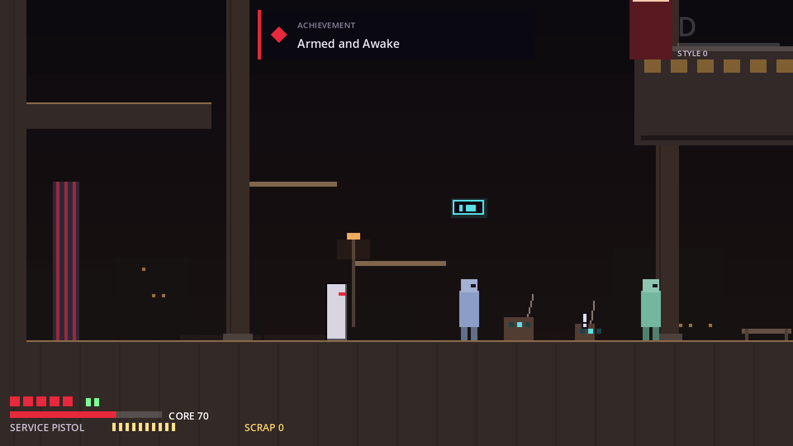
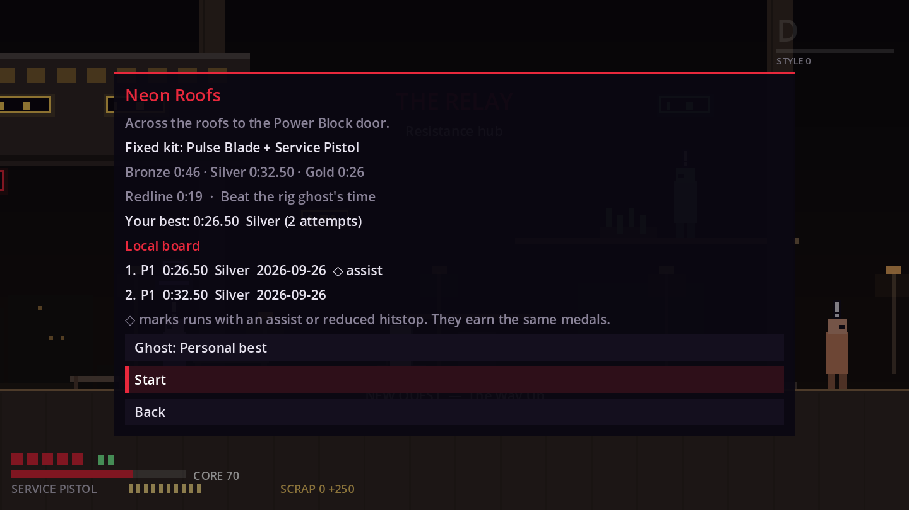
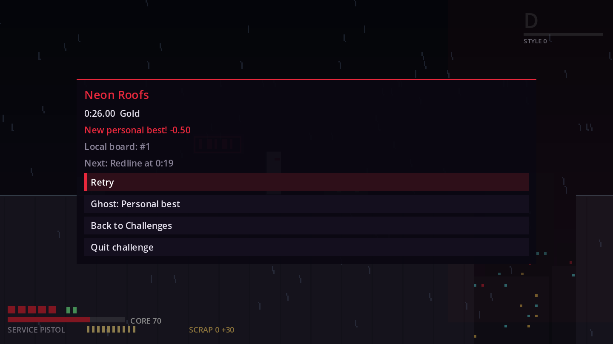
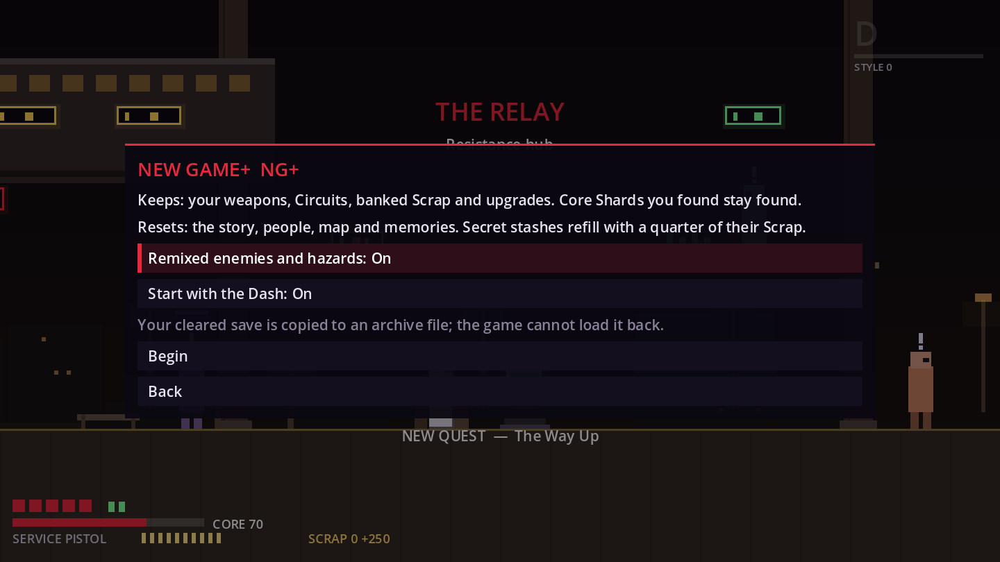
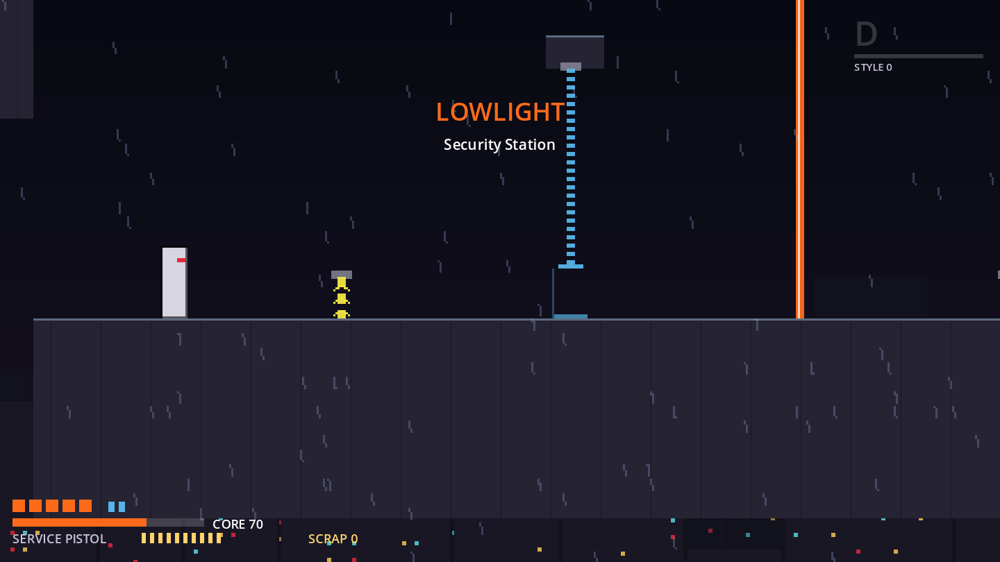
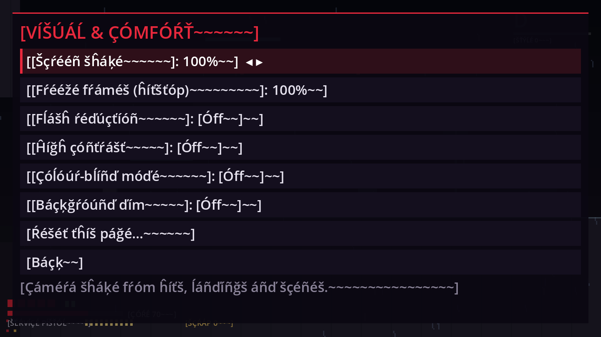
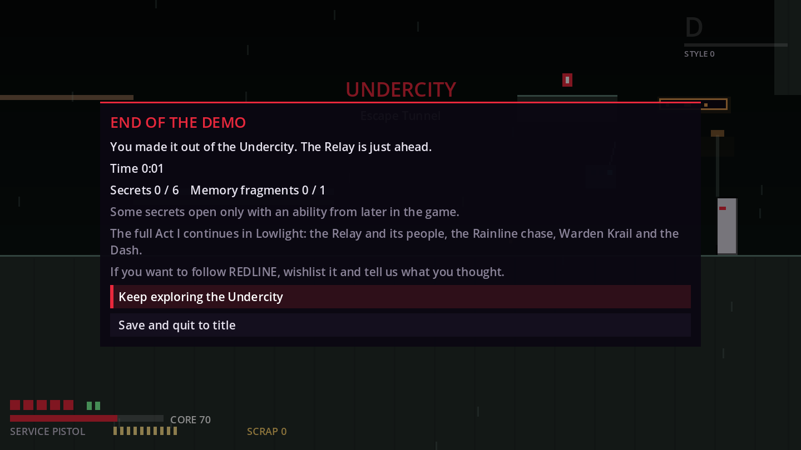

---

## 1. What was built, per §36 M9 item

| M9 item | Built | Proof |
|---|---|---|
| **Achievements** (and stats) | A `Platform` autoload over a `PlatformBackend` with a local store only (D-141): achievements, lifetime and profile stats, rich presence, a leaderboard mirror and a cloud-save hook. **30 Act I achievements** (`data/achievements/`) with conditions in the `Game.check_condition` grammar and/or a stat target; global, retroactive unlocks (D-143); a toast that waits for pauses, scenes and transitions and collapses 4+ unlocks; an Achievements menu (title + journal) with a Records page; spoiler guards on every row naming a boss, NPC or set piece. No grind (counter targets ≤ 25, completion targets equal the live totals, D-146), never a Settings dependency (D-144), dev-made profiles never earn (D-145). `PLATFORM_SERVICES.md` documents the adapter slot. | `test_platform_services`, `test_achievements`, `test_achievements_ui`, `test_stats`; PL-5..PL-15 |
| **Leaderboards and ghosts where viable** | **16 Act I challenges**: boss rematches (Collector, Krail, each also No Hit), time trials (Escape Tunnel, First Pursuit, Neon Roofs, the Rainline), movement-only (Maintenance Shaft), no-hit (Security Station), the Pulse Pit (style and endurance, the §6 Redline Challenge) and the Deep Rig strata. One run director (`Challenges`) swaps in a sandboxed state (D-147), **local top-10 boards** per challenge, **personal-best ghosts** and **rig (developer) ghosts** baked by RouteBot/BossBot through the real run (D-150), a run HUD with fast reset, a result card, the Relay training-rig terminal (D-169), a title entry and a **campaign speedrun timer** with splits (D-152). Online boards and ghosts are not viable offline and are not built (D-150). Assists are neutral tags, never a filter (D-149). | `test_challenge_*`, `test_records`, `test_ghosts`, `test_dev_ghosts`, `test_run_clock`, `test_campaign_clock`, `test_challenges_menu`, `test_pulse_pit`; CH-1..CH-15 |
| **NG+** | NG+ after the Act I close (D-153): the same profile is archived, then converted; weapons, Circuits, upgrades, banked Scrap and found Core Shards carry; the world, story and memories start over; an optional **remix** of enemies, hazards and bosses as data (`data/remix/`, generated by `remix_act1.py`), economy-neutral; secret stashes refill at 25 %, shard spots show husks; known scenes get a short skip hold. | `test_ng_plus`, `test_room_remix`, `test_ngplus_routes`, `test_economy`; RM-1..RM-8 |
| **The Null** | **The Deep Rig** (the Null's player-facing name, D-154): three lore-free strata (Static Lane, Breaker Run, The Floor with a Warden Krail data variant) and a descent, ranked on the Clear–Redline ladder, opened by `null_open` (from `act1_complete`) and the Dash. `null_depth_reached` is now a produced flag; the Redline ending stays unreachable through its other future flags. Theses in `DISTRICTS.md`. | `test_null`, `test_null_routes`; NU-1..NU-6 |
| **Settings** (and §24 accessibility) | Catalog-driven settings (`data/settings/pages/`, D-157), full keyboard and pad **rebinding** with conflicts (swap / move), glyph families (Xbox / PlayStation / Nintendo), vibration with the first rumble output, screen shake, flash reduction, hitstop, **high contrast** and background dim, **colour-blind palettes with always-on shape cues** (D-161), UI scale 100–150 % with scrolling menus, aim / damage / reactor assists, "Always full height" jump, generous checkpoints, map hint strength, UI volume, **pause over dialogue** (D-159), **text auto-advance**, an **adaptive assist suggestion** that never applies anything by itself (D-160), a one-time Comfort & accessibility link on the title (D-168). Backspace backs out of every menu (`ui_back`, D-158). | `test_settings`, `test_settings_menu`, `test_input_bindings`, `test_rebind_capture`, `test_assists`, `test_adaptive_assist`, `test_high_contrast`, `test_palette`, `test_haptics`, `test_ui_scale_hud`, `test_map_hints`, `test_dialogue_pause`; SE-1..SE-6, AC-1..AC-4 |
| **Localization readiness** | `Loc` at the display edge with PO catalogs keyed by the English source (D-162), `LOC_FIELDS` on every text resource and script, `ExtractStrings` (`--write`, `--check`, `--merge`), a generated **en_XA pseudo-locale** (accented, ~35–50 % longer, dev builds only), a font chain with glyph checks, a Language setting and StringRules L-1..L-9, **enforced** since the migration. No translations ship (D-163). `LOCALIZATION.md` is the author and translator guide. | `test_l10n_*` |
| **Demo flow** | An **Undercity demo** as a feature tag (D-165): border barriers at every exit into Lowlight, an end card with placeholder CTA copy, an isolated user dir, recording off by default, the demo's own achievement list; **checked-in `export_presets.cfg`** (Windows / Linux / macOS universal / Web nothreads × full / demo, D-166) and `tools/build/build.py` (`--check`, `--smoke`, deterministic zips, a manifest, web gzip). | `test_build_info`, `test_demo_flow`, `test_export_presets`; DM-1..DM-8, EX-1..EX-11 |

### Supporting work
- **Validation:** eleven rule modules through one seam in `ContentValidator.validate_m9`, and **CrossRules X-1..X-10** (T14): id namespaces and storefront api names across achievements and stats, `MenuHost.IDS` parity with `Main.tscn`, every EventBus signal recorded by Playtest or listed with a reason, the project-wide network / storefront / JavaScriptBridge / `OS.shell_open` ban, raw folder scans only where allowed, SCAN_DIRS coverage, registered flag readers, never-shame words over every M9 string, the knowledge lint over achievement, challenge and demo text, and code-flag completeness. DemoRules DM-4 checks that each demo achievement's needs (flags, nodes, stats) exist inside the Undercity, and (since the audit repair) that a style-rank achievement has recorded reachability evidence: style_s and style_redline have none (PL-6 warning), so they are off the demo list (K-M9-S1).
- **Tools:** the dev console's **Endgame & build** hub (Achievements, Challenges, The Null, NG+, Accessibility, Locale, Demo & build, "Endgame state: Act I complete"), `GhostBake`, `BuildProbe` (`--print-build-info`), `CaptureTour --tour=endgame` with a `TourSandbox`.
- **Playtest:** new EventBus signals are recorded, and the report gains an Endgame section: achievements per session, per-challenge attempts / resets / medals / median vs the Gold target, NG+ cycles with the remix share, Deep Rig runs, restarts and ranks, rebinding players, assist suggestions shown / applied / declined, demo end card reached, language switches.
- **Cross-area tests:** `test_m9_cross` (the D6 §8.2 rows) and `test_zz_user_dir_clean`.

## 2. Things the tests and reviews caught while it was built
- **Backspace could not be a second `ui_cancel` key.** Godot 4.3's LineEdit takes `ui_cancel` as "release focus", so Backspace closed the playtest note instead of deleting a letter. It is now its own non-rebindable `ui_back` action, ignored while a text field has focus (D-158 corrected; pitfall in `CLAUDE.md`).
- **A sandboxed run could write the wrong player into the wrong state** when the room it left captured its player; every swap now goes through `Challenges` with `suppress_leave_capture`, and saves during a run write the held profile unchanged (D-147).
- **The training rig would have lit up mid-story** (the Collector rematch unlocks before the first Relay visit); the rig and the title row wait for the Act I close (D-169).
- **Three Lowlight challenges could lock a player out for good**, because `chase_rainline_done` is only set on an armed chase; they unlock on Krail's defeat (D-148).
- **Rebound pad buttons only worked on joypad 0** (`InputEvent.device` defaults to 0); every rebound event is for all devices (D-158).
- **A registered pseudo-locale catalog leaked into English sessions** (4.3 matches `en` to `en_XA` by language); only the active locale's catalog is registered.
- **The diamond memory marks were tofu** in the default font (and on Web); they are now • / ◊ (D-163, FLAG for the M8 owner).
- **Redirected demos read the full game's settings** (a 4.3 `is_node_ready()` quirk at boot); BuildInfo reloads the demo's own file (K-M9-D2).
- **The test suite overwrote the developer's own save and settings.** `test_zz_user_dir_clean` (T14) found that `test_world_map`, `test_power_shutter`, `test_undercity_routes` and `test_lowlight_m7_routes` (also when `test_routes_assist_variants` replays them) saved into the real `user://saves`, and that `test_music_menus`, `test_demo_flow`, `test_m9_foundation` and the ChallengeHarness suites closed Settings onto the real `settings.cfg`, on every run. They now use temp paths (setup and teardown only; no test body or route step changed). The capture tours still write the real user dir (K-M9-T4).
- **T14's own checks:** `top_marks` cannot be earned in a demo (the rig never opens there), so the demo list had ten achievements, not the plan's eleven (DM-4); the audit repair took style_s and style_redline off it (no reachability evidence), leaving eight; `CrossRules` found no network symbol, no stray raw scan beyond two user:// helpers now on the allowlist, and every folder scanned.

- **The M9 audit (after this report) found and fixed:** a web demo's rebinds and language loaded but were never applied after a reload; the Journal header still showed a death count (§24); the NG+ confirm step opened on the destructive button; en_XA weapon names ran into the HUD ammo pips (the eg_l HUD frames above predate the fix); the dev Achievements page overflowed 270 px on a fresh store; CaptureTour wrote the developer's platform store at exit; suites left `user://test_*` files and, on a clean user dir, `settings.cfg`. See CHANGELOG and K-M9-S1 (style-rank reachability, left open and flagged).

## 3. CaptureTour --tour=endgame (51 PNGs)
Run: `xvfb-run -a -s "-screen 0 1600x900x24" godot --fixed-fps 60 --rendering-driver opengl3 res://devtools/CaptureTour.tscn -- --out=/abs/dir --tour=endgame [--only=a,c,n,s,l,d,v]`. It runs in a `TourSandbox` (saves, playtests and the platform store under `user://capture_tour`, wiped before and after; a full build, English), and exits 1 when an expected shot is missing.

| Section | Shots |
|---|---|
| a achievements | `eg_a_01_toast`, `02_toast_collapsed`, `03_list`, `04_list_locked`, `05_records`, `06_dev_page` |
| c challenges + Deep Rig | `eg_c_01_relay_terminal`, `02_list`, `03_detail_assist_tag`, `04_run_hud_dev_ghost`, `05_pause_in_run`, `06_result_new_best`, `07_pulse_pit_hud`, `08_deep_rig_block`, `09_stratum_setpiece`, `10_descent_splits` |
| n NG+ | `eg_n_01_ngplus_remix_on`, `02_ngplus_remix_off`, `03_ngplus_confirm`, `04_title_ngplus_rows`, `05_remix_warden_tower` |
| s settings | `eg_s_01_settings_main`, `02_assists`, `03_controls_pad_ps`, `04_rebind_conflict`, `05_high_contrast_hud`, `06..08_scanner_default / red_green / blue_yellow`, `09_hud_150`, `10_settings_150_scrolled`, `11_assist_card`, `12_pause_over_dialogue`, `13_map_guided` |
| l en_XA | `eg_l_01_title_pseudo`, `02_pause`, `03_settings`, `04_dialogue`, `05_achievements`, `06_challenges`, `07_demo_card`, `08_hud`, `09_settings_pseudo_150` |
| d demo | `eg_d_01_title_demo`, `02_border_barriers`, `03_demo_card`, `04_demo_card_150`, `05_continue_refused` |
| v dev hub | `eg_v_01_dev_hub`, `02_locale_page`, `03_demo_page` |

Seen while reviewing the shots: in `eg_c_04_run_hud_dev_ghost` the rig ghost is ahead of Rook and off-screen at the shot frame; `eg_n_05_remix_warden_tower` shows the tower's entry, where the remix changes nothing visible; `eg_c_10_descent_splits` is a result card without the per-stage table (the dev finish ends the descent at stage 1); the area banner still shows in some room shots. The achievement list's unlock dates follow the machine clock (record dates use a fixed "now").

## 4. Pixel regression against the pre-M9 baseline
All six older tours (movement 7, combat 5, slice 34, ui 13, undercity 17, story 51) were re-run and diffed against the baseline taken before T01 (`scratchpad/m9/baseline`). Every diff is one of the documented changes, or run-to-run noise that already differed between the baseline and the post-T01 capture:

| Frames | Cause |
|---|---|
| `u01_title` | T01/T07: the Achievements row, the build label, the title layout (D-168) |
| `u05_journal` | T07: the Journal's "Achievements…" row (R07.11) |
| `u06_settings`, `st_settings_subtitles` | T03: the catalog-built Settings pages |
| `u07_slice_end`, `st_act1_card_menu`, `st_act1_card_menu_no_dead_air` | T09: the Act I card drops the death count and adds the training-rig / NG+ line (R09.13) |
| `u13_dev_console` | T01: the "Endgame & build…" hub row |
| `s_SecurityStation_from_power`, `st_security_b1_before/_after` | T12: ScannerBeam shape cues (dashed / dotted / solid, "!" lamp) |
| `s_WardenTower_from_bell`, `s_SmugglerRoute_from_stack`, `uc_CollectorBay_from_lift/_from_tunnel`, `uc_collector_fight`, `st_collector_bay_before`, `st_collector_title`, `st_krail_title`, `st_warden_tower_before`, `s_boss_fight` | T12: elite corner notches, the Collector eye's lamp ring, hollow empty injector pips, Krail's crackle on a physics-frame counter |
| `st_journal_gallery` | T13: memory marks • / ◊ and the shorter pending hint (R13.2) |
| `s_Relay_challenges` (new) | T08: the Relay's new `challenges` spawn next to the training rig (the slice tour visits every spawn) |
| movement dust shots, `c01/c02/c04`, `u08_report_moment`, `u12_hitboxes_perf`, `st_mem_uc01_detail` | Run-to-run noise (particles, the perf graph, a caret), already different between the baseline and the post-T01 capture |

One diff is outside the planned list and needs a human look: in `s_SmugglerRoute_from_stack` and `s_WardenTower_from_bell` the Anchor hint ("Anchors save, heal and refill…") is at a different point of its fade at the shot frame (full in the baseline, faded now). It is a timing change of a transient hint, likely from T13's display-ready hint path; nothing else in those frames moved apart from the T12 cues. Before/after pairs (left: before M9, right: now) are in `media/m9/`:

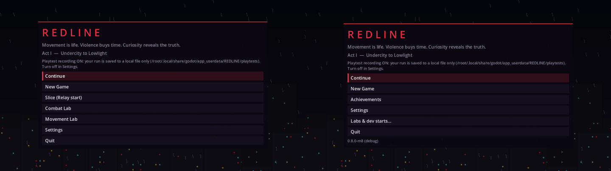
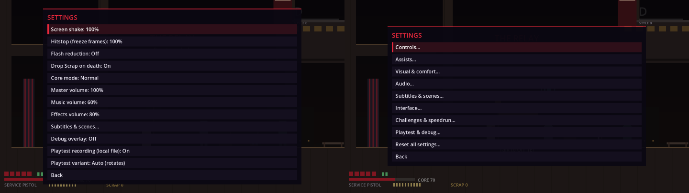
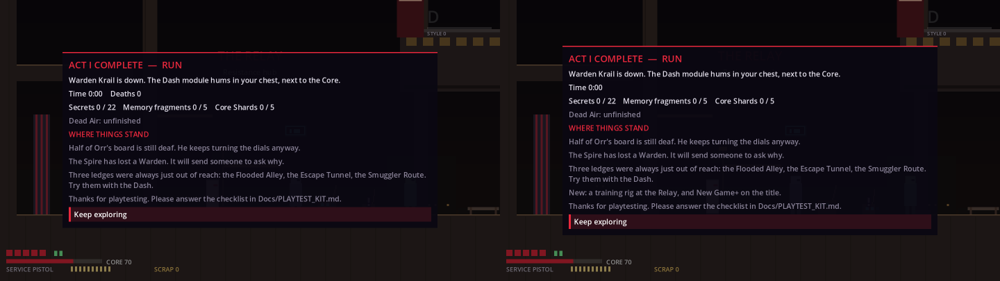
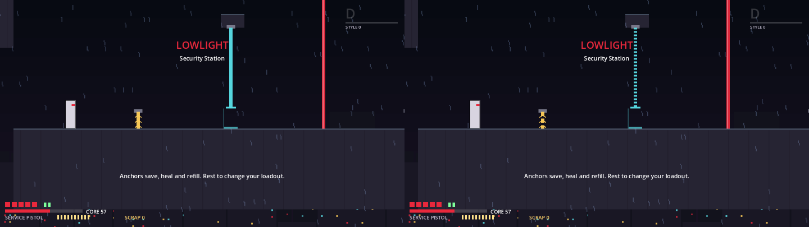
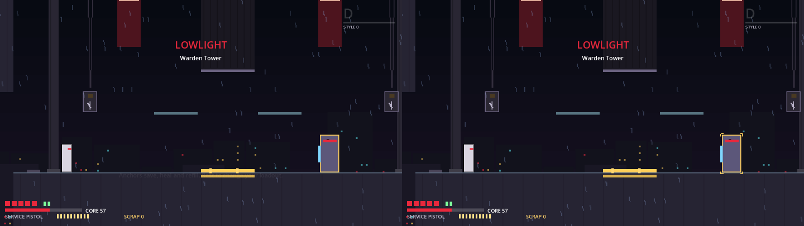
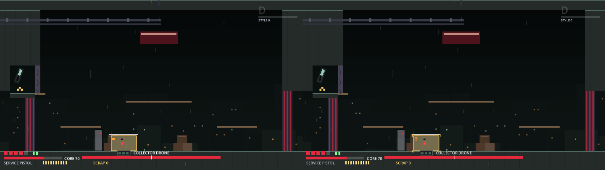
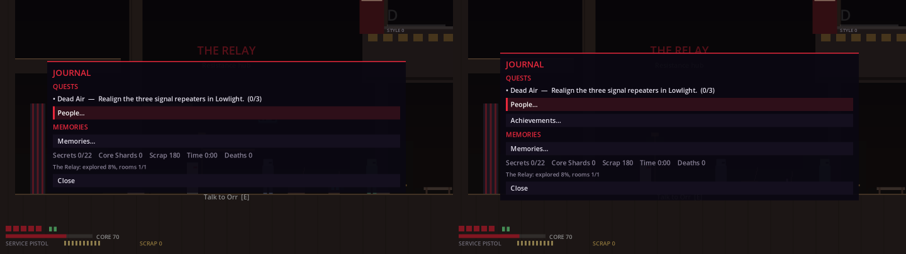
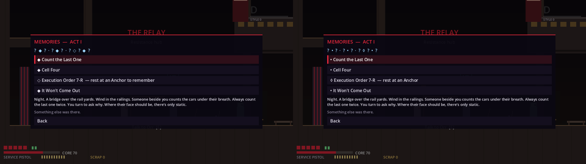
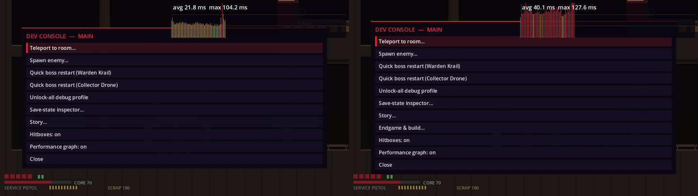
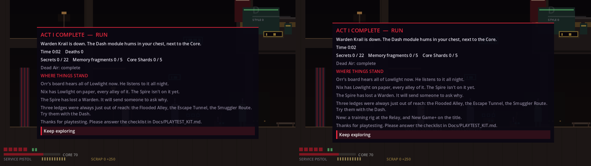
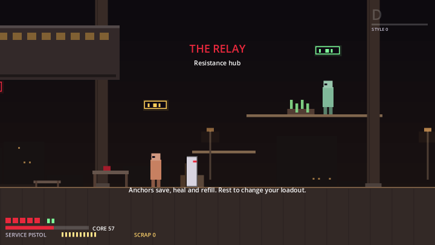

Note: the baseline was captured with the developer's own `settings.cfg`; since T01 every tour takes the settings defaults. No frame in this run differed for that reason.

## 5. Measured numbers
**Medals** (D-150; Redline = the rig ghost × 1.1 rounded up to 0.5 s; Gold × 1.35, Silver × 1.7, Bronze × 2.4; provisional):

| Challenge | Bronze | Silver | Gold | Redline |
|---|---|---|---|---|
| br_collector (+ no hit) | 78.0 s | 55.5 s | 44.0 s | 32.5 s |
| br_krail (+ no hit, no ghost) | 144.0 s | 102.0 s | 81.0 s | 60.0 s |
| mo_maintenance_shaft | 44.5 s | 31.5 s | 25.0 s | 18.5 s |
| nh_security_station (no ghost) | 60.0 s | 42.5 s | 34.0 s | 25.0 s |
| tt_escape_tunnel | 52.0 s | 37.0 s | 29.5 s | 21.5 s |
| tt_first_pursuit | 95.0 s | 67.5 s | 53.5 s | 39.5 s |
| tt_neon_roofs | 46.0 s | 32.5 s | 26.0 s | 19.0 s |
| tt_rainline | 74.5 s | 53.0 s | 42.0 s | 31.0 s |

Pulse Pit scores: style 1200 / 2400 / 4000 / 6000, endurance 2000 / 4000 / 7000 / 11000.

**Deep Rig pars** (placeholders, D-154): Static Lane par 40 / redline 30 s (bot 11.63 s, no hit); Breaker Run 50 / 36 s (bot 12.00 s intended, 12.95 s expert line; shutter margins NS1 0.45, NS2 0.62, NS3a 1.38, NS3b 0.72 s); The Floor 100 / 70 s (harness kill 2.40 s after the intro).

**Economy** (`ECONOMY.md`): first run 1,772 Scrap one-time (79 % of the 2,230 stock), NG+ with remix 1,334 (60 %); one re-clear 332 in both, so the remix is Scrap-neutral.

**Bakes:** `GhostBake --challenge=all --check` re-simulates the seven rig ghosts in 15.6 s (headless): br_collector and br_collector_nohit 1,749 frames (29.15 s), tt_first_pursuit 2,149 (35.81 s), tt_escape_tunnel 1,167 (19.45 s), tt_neon_roofs 1,021 (17.01 s), tt_rainline 1,683 (28.05 s), mo_maintenance_shaft 1,003 (16.71 s); every one matches its shipped ghost and prints the medal row above.

**Builds** (`build.py --targets linux,windows,macos,web --kinds full,demo --gzip-web --smoke`; budgets: desktop zip ≤ 40 MB, web gz ≤ 12 MB, macOS universal ≤ 60 MB, warnings only):

| Zip | Size | Budget |
|---|---|---|
| Linux full / demo | 25.7 MB / 25.7 MB | ≤ 40 MB |
| Windows full / demo | 31.7 MB / 31.7 MB | ≤ 40 MB |
| macOS universal full / demo | 53.4 MB / 53.4 MB | ≤ 60 MB (own budget, D-166) |
| Web full / demo (zip, for reference; the 35.4 MB wasm deflates to 8.0 MB) | 9.6 MB / 9.6 MB | none for the zip: the 12 MB web budget (`BUDGET_WEB_GZ`) is on the summed `.gz` sidecar payload |

Smoke (Linux, release): full and demo report `0.9.0-m9`, 7 ghosts, data counts achievements 30, challenges 19, endings 5, memories 7, npcs 9, quests 3, sequences 13; locales `['en']` (release hides en_XA). Linux debug export: locales `['en', 'en_XA']`, so both catalogs are packed. The demo pck is the same size as the full one because content is gated, not stripped (K-M9-5).

## 6. Flagged decisions (please confirm or overrule)
- **D-140 (scope and process):** M9 covers Act I only and was started before the §44 playtest because you asked. Every number is provisional; Advanced Circuit builds and weapon mastery challenges wait for §44 data (TODO).
- **D-141** No storefront integration is built (vs §36 M9 "Steam" and §29): Steam achievements, cloud saves, boards and presence stay a documented adapter slot under the no-networking rule; building it needs your decision.
- **D-142** One profile, global settings (vs §29 multiple profiles).
- **D-144** Achievements never read Settings (vs §6 "leaderboard eligibility"): difficulty goals belong to challenges.
- **D-146** Achievement targets (circuits_8, the grind cap) are tuning; style_s and style_redline have no scripted proof that Act I reaches ranks S and REDLINE (K-M9-S1).
- **D-148** The Act I challenge set; no weapon mastery, no Mastery Tokens (vs §29, §12); one challenge covers survival and reactor endurance.
- **D-149** Assists and reduced hitstop are neutral tags on the same boards; medals use a separate Clear–Redline ladder (vs §6, §10, §24).
- **D-150** No online ghosts; medals anchor on bot ghosts with wide human margins; Krail and the Security Station have no ghost.
- **D-153** NG+ after the Act I close (vs §30 postgame after the finale); no player-facing restore of the cleared save (a title row is the proposed fix).
- **D-154** The Deep Rig opens after Act I (vs §15/§23), is called "Deep Rig" in player text (knowledge lint), and its pars are placeholders.
- **D-155** A ranged enemy on a breaker clock (vs the Lowlight rule).
- **D-156** Challenge-only rooms before §44; their theses landed after the rooms (order only).
- **D-157** Settings global; reduced boss damage is its own assist; only jump hold/toggle; **rumble on by default for pads before the playtest** (vs §37.2/§44; the fallback is data-only).
- **D-158** `ui_*` actions stay fixed (vs §24 full rebinding); debug pad bindings are stripped in release.
- **D-160** The adaptive assist card is on by default (one press turns it off).
- **D-161** Colour-blind support is shape cues + three palettes (no shader); one high-contrast mode; the jump latch may break short hops.
- **D-162** PO with the English text as the key (vs "translation keys" in the brief).
- **D-163** No bundled fonts, CJK/RTL not supported; the memory marks became • / ◊ (**FLAG for the M8 owner**, D-114/D-120).
- **D-164** Line timing follows the displayed text; budgets stay on English (vs D-135).
- **D-165** The demo is the Undercity, gated not stripped, with **placeholder CTA copy** to approve.
- **D-166** `export_presets.cfg` is checked in (reverses K-34); placeholder bundle ids; unsigned / ad-hoc builds.
- **D-168** A one-time Comfort & accessibility link on the title (vs §36: onboarding is M10).
- **D-169** The Relay training rig is a placeholder for Bramm (vs §13, §44).

## 7. Needs a human
- **Run the §44 playtest** (still the gate, `PLAYTEST_KIT.md`, D-068). M9's systems are opt-in and do not change the campaign, but settings, the title rows and the Act I card changed.
- **Approve or replace** the demo CTA copy and the bundle ids before any public build (D-165, D-166).
- **Manual checks the headless gate cannot make:** a Web build (the music stem render stall at the title, K-M9-W1; the audio sliders under sample playback; IndexedDB saves; Esc in fullscreen with P and Backspace as the fallbacks), Windows and macOS exports (SmartScreen / Gatekeeper), real pads (rumble strength, PlayStation / Nintendo names, rebinding), and a first-time windowed run of a challenge, NG+ and the demo border.
- **Feel checks:** are the medal targets reachable by humans (Gold, Redline)? Do the Deep Rig pars make sense? Does the adaptive assist card read as helpful rather than judging? Do the shape cues read in each palette?
- **Look at** the endgame tour frames and the pixel-diff pairs above, including the Anchor hint fade in two slice shots.
- Acts II–V, Ironworks and M10 start only when you ask, ideally after the playtest.

## 8. Known issues
K-M9-1 to K-M9-7 and the lettered K-M9 rows in `KNOWN_ISSUES.md`. In short:
- Act I scope and provisional numbers (K-M9-1, K-M9-4); only profile 1, and the NG+ archive restore is dev-only (K-M9-2); no rig ghost for Krail or the Security Station (K-M9-3).
- The demo pck still holds Lowlight (content gated, not stripped, K-M9-5); no demo→full import (K-M9-6); unsigned builds (K-M9-7).
- Web: a likely stem render stall on nothreads, sample audio, no Quit, clearable saves (K-M9-W1).
- Localization: world-art text stays English (K-M9-L3), no number formatting, no CJK/RTL (K-M9-L4), no shipped translations (K-M9-L5), one L-8 warning (K-M9-L2).
- The title keeps its old look after a UI size change on its quick page until reopened (K-M9-U1); redirected demo settings load through a fallback (K-M9-D2).
- The capture tours still write the developer's real user dir (the story tour's profile save, settings and platform files rewritten at exit, the ui tour's playtest install file); only the endgame tour is sandboxed (K-M9-T4). Some suites leave files in their own `user://test_*` folders (reported by `test_zz_user_dir_clean`).
- The test run's exit still prints the pre-M9 engine noise (K-M9-T1).
